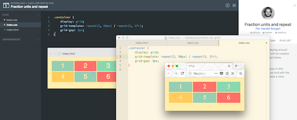
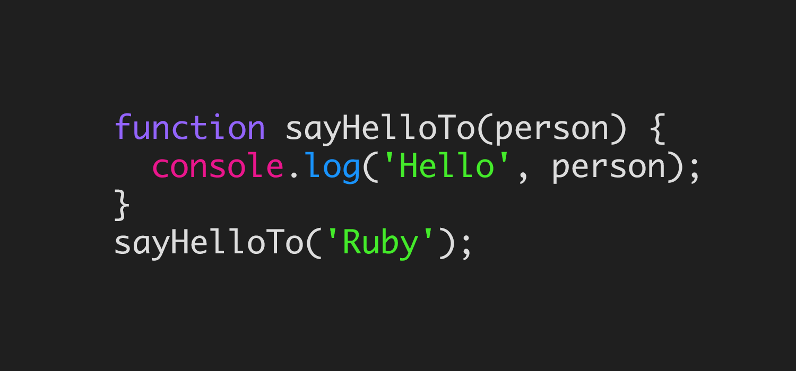
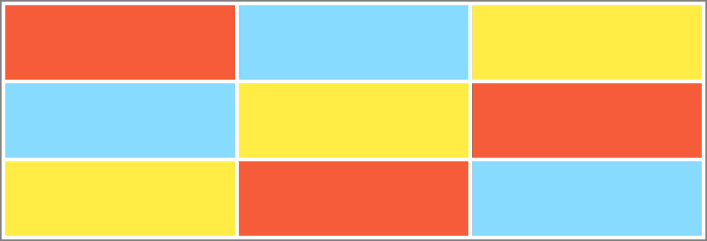
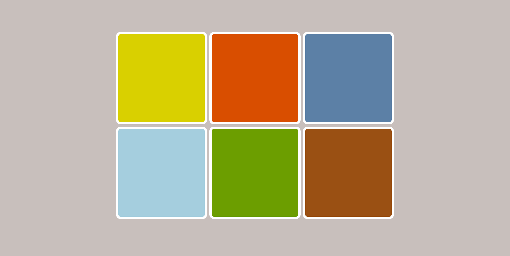
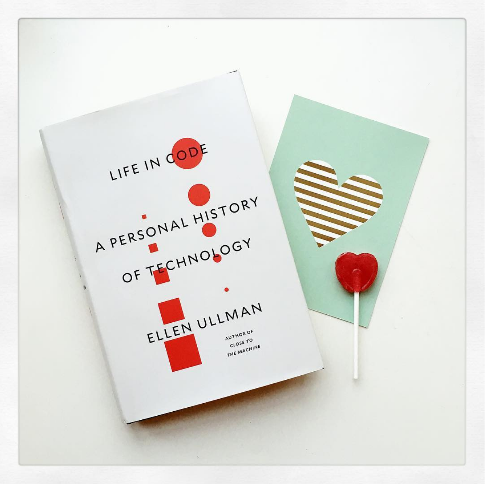
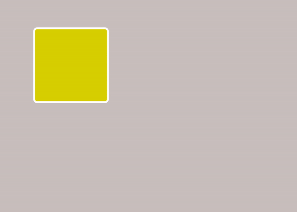

# 100 Days Of Code - Log - Antzée

## Hi! 👋🏻

I'm a former pianist & piano teacher who in 2017 started to code. So far, I've done the "Build websites from scratch" course at Codecademy plus experimented with making images & animations with code, like the self portrait above (pure CSS - no SVGs) 👩🏻‍💻
  ➡️ Some of the things I've made: https://codepen.io/Antzee
  ➡️ You can also find me on [Twitter](https://twitter.com/Antzee_)

⭐️ My main goals for 100 Days Of Code: improve my HTML/CSS skills + learn more about JavaScript.⭐️

## Log 🗓

### Day 1 - Monday 01.01.2018 - the beginning
Simple start: commit to the 100 Days Of Code challenge and set it up on GitHub. Also (although it's not really coding) learn how to use markup language to format and add images in my log.
  

### Day 2 - Tuesday 02.01.2018 - CSS Grid - first look

 
  Did the three first lessons of Scrimba's "Learn CSS Grid for free" online course. It seems really good since it's an interactive video so I could play with edits both on the interface and in my own editor. Link: https://scrimba.com/g/gR8PTE
  

### Day 3 - Wednesday 03.01.2018 - JavaScript back to basics: variables and arrays

 

[This talk](http://bit.ly/1byDzwo) by Kathy Sierra made me realise that I need to change how I study JavaScript (which I until now have found really difficult). So I’ve decided to try another way of structuring my learning process. Instead of just following one learning source, I'll:
- *combine different learning sources (videos and text)*
- *write my own versions of examples*
- *not move on until I feel comfortable with each topic.*

Today, I went back to the beginning and revised variables & arrays. It's not the hardest part of JavaScript, but a good way of setting up and practicing a different workflow.

Today’s learning resources:
- [“Practical Javascript” by Gordon Zhu on Watch and Code](https://watchandcode.com/p/practical-javascript)
- [“The complete JavaScript course” by Jonas Schmedtmann on Udemy](https://www.udemy.com/the-complete-javascript-course/)
- [W3schools](https://www.w3schools.com/js/default.asp) for additional examples.
  

### Day 4 - Thursday 04.01.2018 - JavaScript back to basics: functions

 

Started on JavaScript functions. Looked through a couple different videos, wrote my own versions of the examples, and talked some of it through with the bf. 💑
  
Since only reading and watching videos isn't enough, I’m trying to find a good way to practice writing own code (both for learning and for collecting examples). I like to use my regular editor, so for each topic, I make an HTML file with a JavaScript file linked to it to write examples. I test the code in a browser web console (also new to me, so I get to learn how that works). I think it might be useful to write a lot of own examples, so will start doing that.
  
Today’s resources: the same as yesterday.
   📕 By the way, ["Hello Ruby"](http://www.helloruby.com/) is a lovely children's book about programming. It includes lots of activities which should be nice to do together with grownups and/or friends. The book is written and illustrated by Linda Liukas.
  

### Day 5 - Friday 05.01.2018 - Continuing CSS Grid; JS function practice

 

Today: CSS Grid + a little JavaScript. I went over the first Scrimba course videos again + looked up [Rachel Andrew’s CSS Grid videos on YouTube](https://www.youtube.com/watch?v=Dz9BzY21Zks&list=PLQkVA6z3dFvbnBJetfYDAF3-cG_ubgdZR). I think it’s good to switch between different types of resources, so I started reading [Mozilla’s CSS Grid Layout articles](https://developer.mozilla.org/en-US/docs/Web/CSS/CSS_Grid_Layout) on the topic as well. Played with the  first basics, like the fr unit, and made my first grid layout (screen shot above).
  
I also wrote a couple of JavaScript function examples to practice what I learned yesterday.
  
😍 Today's clever eye candy: [this pen by Josh Collinsworth‏ on CodePen](https://codepen.io/joshuajcollinsworth/full/aEJGvg/) 😍
(Don't forget to scroll)
  

### Day 6 - Saturday 06.01.2018 - CSS Grid basics: getting familiar with the syntax

 

Continued with CSS Grid, combining video, reading, and writing. I like to write my own examples so I’m sure I really understand everything in the code, so I made these retro-inspired babies who I’m gonna continue experimenting with to understand placement on the grid. I’ll share some code examples at a later stage. Am feeling a bit more comfortable with the syntax today than I felt yesterday 💪🏻
  
Today’s resources:
- [Firefox Devtool’s playground for CSS Grid](https://mozilladevelopers.github.io/playground/css-grid)
- [Scrimba’s “Learn CSS Grid for free”](https://scrimba.com/g/gR8PTE) - video 4
  

### Day 7 - Sunday 07.01.2018 - Reading day

 

First week of the 100 Days Of Code challenge done! ✅ I'm not doing the challenge just to code every day; I'm doing it because I want to learn new stuff, which is always demanding. I'm making it even more demanding because I'm challenging myself in _how_ I study: trying to break the subjects down to manageable pieces, using different sources / methods to study each piece, and not moving on until I really have understood it. ✍🏻
  
So today I'm taking a day off from the screen to read this book I got from a friend: "Life In Code - a personal history of technology" by Ellen Ullman. It gives an interesting perspective because she's a woman and because she's been in the field since 1978. Back then, I was a kid in the Norwegian countryside and hadn't even heard of computers... 🖥
  Photo from [my Instagram](https://www.instagram.com/ameliacodes/) 📔❤️
  

### Day 8 - Monday 08.01.2018 - CSS image with JS to hide a div

 

Made this to put on my Facebook since I plan to be logged off a lot more than usual. I didn’t manage to do it exactly the way I wanted, which was a proper keyframes-animated toggle switch combined with JS to change the background. Now it's basically two images on top of each other below the actual button (which is transparent), and when someone clicks the button, the Facebook image gets hidden. So it’s a bit hacky, but the result looks more or less as I intended + I learnt to hide a div with JS.
  
The two images behind the switch are me-made in Photoshop Elements. PE was the quickest solution today since I haven’t worked much with Inkscape and SVGs yet. The sky image is clouds on a transparent background, which means I can control the background colour in CSS. It didn’t work as expected with gradients though, but I found a solution + explanation [here](https://stackoverflow.com/questions/5681813/transparent-background-image-with-a-gradient). The code:

background-image: url(‘../LINK’),
   linear-gradient(to bottom, rgb(120, 209, 221), rgb(213, 234, 236));

How to use JavaScript to hide a div:
- [w3schools tutorial](https://www.w3schools.com/howto/howto_js_toggle_hide_show.asp)
- [jsfiddle example](http://jsfiddle.net/BQUyT/2/)
  

### Day 9 - Tueday 09.01.2018 - CSS Grid basics

 

Today: more CSS Grid. I understand the basic principles and syntax now: columns, rows, and column lines. The GIF shows the responsive 12-column example I made with my retro-inspired design from day 6. I also familiarised myself with template areas. I’m just starting out, but so far, I really, really like CSS Grid. 😍 The code is beautiful - minimalistic and simple - and there are so many possibilities because one can structure content on both the horizontal and vertical axis. Am excited to see how it behaves with content inside! I also think one can do some fun creative stuff with it as well… 🤓

Today’s resources:
- [Scrimba Learn CSS Grid for free](https://scrimba.com/g/gR8PTE) Video 4 and 5
- Corresponding [Grid by Example](https://www.youtube.com/playlist?list=PLQkVA6z3dFvbnBJetfYDAF3-cG_ubgdZR) videos by Rachel Andrews.
  

### Day 9 - Tuesday 09.01.2018 - Hidden divs: CSS Grid and JavaScript

 

Today, I combined my newly acquired CSS Grid and JavaScript function knowledge to make this. The idea was to see if it was possible to have a div hidden by default and then make it visible again. I’m planning a small fun project with this, looking forward to doing that tomorrow.
  
⬛️◽️🔲◼️▫️⬜️◾️◻️▪️🔳 
▫️⬜️◾️◻️▪️🔳⬛️◽️🔲◼️ 
🔲◼️▫️⬜️◾️◻️⬛️▪️🔳◽️ 
▫️⬜️◾️◻️▪️🔳⬛️◽️🔲◼️ 
⬛️◽️🔲◼️▫️⬜️◾️◻️▪️🔳
  
Progress: I still have to look up how to do things with JavaScript, but I hope that 1) seeing other people’s examples and 2) adapting those examples so they work with my code eventually will strengthen my understanding of the different JavaScript concepts.
  
Resources: I used the JS code from [W3schools: making a hidden by default div visible with JavaScript](https://www.w3schools.com/css/tryit.asp?filename=trycss_display_js).

  
