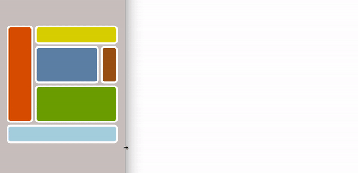

 
### Hi! 👋🏻

I'm a former pianist & piano teacher who in 2017 started to code. So far, I've done the "Build websites from scratch" course at Codecademy plus experimented with making images & animations with code, like the self portrait above (pure CSS - no SVGs) 👩🏻‍💻 Here are some of the things I've coded:
  ➡️ My 100 Days Of Code log on [GitHub Pages](https://antzee1.github.io/100-days-of-code/)
  ➡️ Some of my stuff is on [CodePen](https://codepen.io/Antzee)
  ➡️ I also have a [YouTube channel](https://www.youtube.com/channel/UCMn3c-c4h9571gBzmkbKYig) for my animations.
  ➡️ Connect: [Twitter](https://twitter.com/Antzee_) and [Instagram](https://www.instagram.com/ameliacodes/)

⭐️ My main goals for 100 Days Of Code: improve my HTML/CSS skills + learn more about JavaScript.⭐️

# LOG 🗓

⬆️ Order of entries: newest to oldest ⬆️
### Day 30 - Tuesday 30.01.2018 - Website layout: movable divs

  
Woke up with a new idea this morning: to try implementing movable divs in my website. If I don't want to use it after all, I'll know how to code it for another project. I already did it on the volume slider project, but there were a couple things that didn't work now so I tried a couple other methods found online. One of them was new to me: to build and style the div in JavaScript, which was pretty cool. So I did learn something after all + got help from my house teacher (the bf) on the other code so I can continue working tomorrow. But most of the day, I felt like in the picture, which I coded tonight just to illustrate my day. ☁️
  

### Day 29 - Monday 29.01.2018 - Website layout: making a pop-up box
Continued working on my website. It's starting to take shape! I needed a pop-up window, so I found a tutorial online, dismantled the code to understand how it worked, and took away what I didn't need.
  

### Day 28 - Sunday 28.01.2018 - Website layout and revamping the log
Today, I worked on a website layout detail. Partly because I had watched yesterday's talk by Mandy Michael, I understood how to make a 3D-effect with box-shadow, like so:
  
  

I also got a serious amount of help from my house teacher (the bf) to get rid of the Jekyll Merlot theme for the log and set up the files so I could make the layout from scratch on GitHub. So happy I could use my favourite fonts! 😍
  
  

It needs a bit more tweaking, plus there should be a media query for small screens. Am super happy because I learnt a bit more about how GitHub works, which is useful since I'll be using GitHub for my website as well.
  

### Day 27 - Saturday 27.01.2018 - Website drafting
💃🏻 IT WORKS! IT WORKS!!! 💃🏻 No, I’m not talking about my code. I’m talking about my brain... (rolls eyes 🙄) I continued to work on my website project today, and was puzzled by a CSS Grid problem where the ratios kept turning out all wrong. Then I suddenly got the logic... I'm really happy I did the Grid exercises this week. I haven't got a clear understanding of how different types of items behave and influence each other in CSS Grid, but even if I haven't assimilated everything yet, I could use what I learnt this week to troubleshoot. Maybe I should make some kind of summary later.

▶️ Today's video resource: Mandy Michael, who I mentioned last Saturday, just did [a super inspiring talk](https://youtu.be/9EU7urOl1LE) on her work on creative fonts.
  

### Day 26 - Friday 26.01.2018 - Starting #newwwyear
During the Christmas holidays, Jen Simmons started a challenge where the idea is to make or revamp one's own personal website in 2018. I've been thinking about it for a while without coming up with a real plan, except to try to use as much as possible of what I've learnt + hopefully learn more. But this morning I woke up super early with a lightbulb switched on in my head. 💡 So today, I experimented with how to transform my layout idea into code. I'm using CSS Grid and implementing what I've learnt over the last couple weeks, only this is going to be more complex. 😱

My #newwwyear tweet: 
1) Start: today ✅ 
2) Goal: build my first own personal website from scratch, taking it as an opportunity to practice what I’ve learnt + learn more. 
3) Finish: as soon as I can. 
➡️ Everybody can join by tweeting 1) start 2) goal 3) finish + hashtag #newwwyear.
  

### Day 25 - Thursday 25.01.2018 - Responsive study with images - image size optimising
Today, I added images to yesterday's responsiveness study. I didn’t run into any problems, which was almost shocking since I’ve been struggling with this before. Looking at how all the components work together has really helped.

Resource for image resizing: [W3schools](https://www.w3schools.com/css/css_rwd_images.asp)

I also found a helpful [article on image size optimising](https://om4.com.au/client/preparing-image-files-before-uploading-with-wordpress/) and realised how easy it is to reduce the file size in Photoshop Elements. If you use the slider in the dialogue window, you can easily reduce the amount of KB:
  
  

Finally, I wanted to test one of the code snippets from yesterday a bit more. It seems it's not 100% straightforward if you want a scalable layout where everything stays proportionally in place in different-sized browser windows. I found [a very useful pen on CodePen](https://codepen.io/mirisuzanne/pen/bWxaKY?editors=0110) for this, so I made an exercise with text and two images (the background that serves as the Polaroid frame, and the photo) and it resized nicely. I can easily make something like this in Photoshop and then use it as a single image and have it resize without problems, but this is obviously a more flexible solution and it's nice to know the trick for making such layouts in code.

I put the result on YouTube. Click the image below (using an embed code again seems to break my markdown 😡).
  

  

### Day 24 - Wednesday 24.01.2018 -  responsiveness exercise
📚 Continued with my responsive layout study. It’s a lot more clear now how different combinations of relative and absolute size units for divs and fonts generate different results  (some of the combinations are really funky and totally impractical). This is of course a basic topic, but it still confused me. So I found it very useful to write my own examples so I could compare them to each other - both the code and the actual result - instead of just reading about it.

ℹ️nspiration: Matt Rothenberg's [CSS Grid Clash poster on CodePen](https://codepen.io/mattrothenberg/full/RxOeNQ/).  

📝 Some studies suggest that we learn better when we write by hand. Apparently, it’s National Handwriting Day today, so I found this a good day to start doing handwritten notes. Inspiration: [thedailyroe on Instagram](https://www.instagram.com/thedailyroe/).
  

### Day 23 - Tuesday 23.01.2018 - Volume slider video & responsiveness exercises
I set up a YouTube channel today so I can show better video quality of animation. [Here's a video](https://www.youtube.com/embed/sUcEpNwXJ5Y) of the volume sliders in action!
  

🤓 I also have been thinking that I need to understand resizing / responsiveness better, so I decided to set up a few examples with different properties, like height, width, and font-size to study how the boxes and the text behave differently on resizing. I also checked the different divs when zooming in / out with command- / command+, because this will also affect the layout. 😯
  

### Day 22 - Monday 22.01.2018 - Volume slider progress

Today, I re-coded my avatar for social medias + found out how to make the sliders look spherical. And the sliders are movable now! I found a couple possible JavaScript solutions online, and I managed to get one slider to move, but needed help from my house teacher (the bf) for the rest: make all sliders move individually + an if else sentence to make the sliders stop at the beginning and end of the slots. Progress is slow, but I have a feeling that JavaScript can be fun once I master it a little bit better.
❇️ 🔴 🌕 🔵 ⚪️
  

### Day 21 - Sunday 21.01.2018 - Random inspiration day

The other day, I saw that one guy had published his log on GitHub Pages. I decided to do the same, messed up my repository quite a bit, got help from my house teacher (the bf) to fix it, and now the log is published and it looks a lot better in that format. 😍 [Take a look here](https://antzee1.github.io/100-days-of-code/) if you're reading this in the ReadMe file.

Next, I got inspired by a pretty [Dribbble shot of moving volume sliders](https://dribbble.com/shots/3106033-Volume-Sliders) by Daryl Bruinsma. I'm curious about user interactivity, so I wanted to see if it was possible to click and drag similar sliders, so I went online and found the JavaScript code for a draggable div. Spent the rest of the day doing the styling - struggled a bit with placement due to the JavaScript, but finally now everything stays in place, and the green slider is clickable. Next up is to adapt the JavaScript.

The colours are the same as the colours on my dad's beautiful old Hermes 3000 typewriter from the early 1960s. ❤️
  

### Day 20 - Saturday 20.01.2018 - CSS Grid with only images: a look at animation

Did a bit of light weekend coding. I had seen [a pen by Mandy Michael on CodePen](https://codepen.io/mandymichael/full/BWyYYP/) where it was possible to change the text directly on the interface, so I wanted to investigate that. Here's the result - you can try it out [here on CodePen](http://bit.ly/2DltdxQ). It works on iPad and iPhone as well as on computers, and it resizes nicely to all viewports, so I think I finally have got a better understanding of that!

Mandy Michael's pen is obviously a whole lot more exceptional since she also coded the letters! 😍

💡 Today's inspiration: The Instagram account of graphic designer and illustrator [Maria Diamantes](https://www.instagram.com/mariadiamantes/). 😍
  

### Day 19 - Friday 19.01.2018 - CSS Grid with only images: a look at animation

Was inspired by [this animation by Mantas Gr on Dribble](https://dribbble.com/shots/3531807-Reel-2017) today, so I wanted to see if I could animate movements of CSS Grid elements the same way - meaning that the item moves from one grid to another. Unfortunately, it looks like it's not possible, if I don't misunderstand the information I found online. I can make the div change placement on the grid, but it just changes abruptly, so there was no real movement animation effect like I was looking for 😭

Felt a bit like I wasted a day, but I did write code, I practiced CSS Grid, and I guess that finding out what one cannot do is also part of learning! 🤔

❗️Update 20. January: I found a solution right after writing this yesterday - the transform: translate property. It doesn't *really* change the position of the div, but for all practical purposes, it looks like it does the job. 😍

The photos are from my Instagram account and are all related to Argentine social tango. Nope it's not like on television. 🤣
  

### Day 18 - Thursday 18.01.2018 - CSS Grid with only images: squares

Made another CSS Grid layout. I struggled a bit, so it's clear that I need to study more and practice a lot! 😐 But in the end it worked as intended. 💪🏻 I also put an increase size on hover property on the images. I think that might work better with a responsive layout, though, so will experiment some more.

➡️ Today's resource: The photos I used are by [Simone Hutsch](https://unsplash.com/@heysupersimi) on [Unsplash](https://unsplash.com), a site with high quality, royalty free photos that can be used for whatever we want. It's really wonderful to have access to so many great pics without worrying about copyright. It's still nice to give credit, though. ❤️

Update: I made another version with auto-fit after I had written the log yesterday.
  

### Day 17 - Wednesday 17.01.2018 - CSS Grid with text and images: blog layout

My plan for today was to introduce images in addition to text in a CSS Grid and see if everything behaved. And it did! I started out with the layout I coded yesterday and added screenshots of some of my CSS art (although I'm not sure I dare calling it art), and then I got inspired to change the colours + make a header background-image in Photoshop as well. As I learn more about CSS Grid, I might discover better ways of doing this, but at least for now, it works in four browsers.

This is kinda an old-fashioned blog layout. Next step is to make media queries for smaller screens, and then I'll have to think up other layouts. That's a bit hard for me since I've been blogging for the last ten years, so I'm too used to this type of layout 🙄
  

### Day 16 - Tuesday 16.01.2018 - CSS Grid with text
After yesterday's temporary lapse into fox territory, I felt ready to tackle the CSS Grid resource mountain again today. My plan was to change my retro-coloured Grid test layout into a simple website structure, and see how it would behave with text. After a bit of testing, I decided it worked best with set heights/widths on some divs, and auto on others. Am happy I already was a little bit familiar with Flexbox.

3 responsive columns:

 

2 fixed-size + 1 responsive column:

 

I guess it's easy to forget that one can't really practice layout without an idea about content. So I'll try to think up useful exercises for myself. Next: images and text together; then responsiveness for smaller screens.  
➡️ Today's resource: The Grid inspector in Firefox Developer Edition is super handy for understanding the structure of the layouts one is working on.
  
  

### Day 15 - Monday 15.01.2018 - Foxes! 🦊

Today's plan: CSS Grid deep dive. What actually happened: foxes. The day went something like this: I looked at the page I made yesterday in the grid inspector in Firefox Developer Edition, which looks like a super handy tool. Then I read a CSS Grid article and got overwhelmed, so I customised my Firefox with a fox theme called ‘Mozilla: Firefox OS’ and coded a fox. He is my own design and he lives [here on CodePen](http://bit.ly/2mzrKwP). 🦊

📕 Today's resource: [This article](http://jensimmons.com/post/feb-27-2017/learn-css-grid) by Jen Simmons. It's chock full of links to CSS Grid learning resources.
  

### Day 14 - Sunday 14.01.2018 - Tango music learning game - flip cards inside CSS Grid

Today, my goal was to find a way of flipping a div with mouseclick (not just hover like yesterday's example), then make more divs and see if I could make  the flip cards work with CSS Grid. Needed lots of help from my house teacher (the bf). Progress has been made, though, and I hope I'll learn from using these concepts more.
  

### Day 13 - Saturday 13.01.2018 - Planning ahead: tango music learning games

I've been deeply in love with Argentine tango for the last 13 years. It's not the tango you see on TV (which is mostly show tango or ballroom tango), but Argentine tango as it's danced socially in Buenos Aires and all over the world. Since I'm a musician, I'm more than average interested in the Argentine tango music. I don't play tango, but I DJ regularly at Argentine social tango events in Oslo and also sometimes abroad.

Many dancers are interested in learning more about the music, so my bf, who also is a tango dancer, suggested that I study JavaScript by making some games about Argentine tango music. I think it's a nice idea, so today I found a tutorial on how to make a flip card using CSS and JS, and customised the code to learn how it works. Next step is to think of a concept.

➡️ Today's resource: [This article](https://davidwalsh.name/css-flip) from David Walsh.
  

### Day 12 - Friday 12.01.2018 - Crazy interactive CSS Grid + JavaScript project done

I finished the crazy CSS Grid + JavaScript project and put it online. I ended up using about 60 fractions in the grid in order to get the ratios on each square as true as possible to the original: the work “Composition A”, painted by Piet Mondrian in 1923. The idea is to start with just one visible square and the rest of the squares hidden, and have everything chained so when you click one square, the next one appears.

➡️ [View on CodePen](https://codepen.io/Antzee/full/dJKbrK/)

I made one JavaScript solution that worked; and when I asked the bf about other ways of doing it he suggested two alternatives. I used the first one since I didn’t understand the second one (but that one is definitely something I’ll work on since it was a nice solution with very little code).

There were a couple hiccups (if someone reads this and has an explanation, let me know via [Twitter](https://twitter.com/Antzee_) or CodePen):

- It doesn’t work in Safari on my MacBook unless I first click the first square, then switch to another desktop and back again.

- The reload page code I put on the last square doesn’t work in CodePen, only when I have the files locally on my computer.

In spite of this, I'm pretty happy with the result, mainly because I learnt both some CSS Grid and some JavaScript from making it! Already started thinking about making more (and better) interactive projects. 👩🏻‍💻
  

### Day 11 - Thursday 11.01.2018 - Crazy interactive CSS Grid + JavaScript project sneak peek

The small project I mentioned yesterday turned out to be a big project. Go figure. 😜 It's almost done, though, so will post it tomorrow - I'll put it on CodePen since it's interactive.
  
Today's resource: the bf. 😍 After I had written yesterday's log, I discussed with him whether there would be ways of writing less JavaScript code for this project. He suggested two different ways, and we looked at it together. In addition to reading, writing and watching tutorials, I find that it's really helpful to discuss code concepts with a real person, so I recommend to do that if you can find someone (preferably someone positive and helpful, of course)!
  

### Day 10 - Wednesday 10.01.2018 - Hidden divs: CSS Grid and JavaScript

Today, I combined my newly acquired CSS Grid and JavaScript function knowledge to make this. The idea was to see if it was possible to have a div hidden by default and then make it visible again. I’m planning a small fun project with this, looking forward to doing that tomorrow.
  
⬛️◽️🔲◼️▫️⬜️◾️◻️▪️🔳 
▫️⬜️◾️◻️▪️🔳⬛️◽️🔲◼️ 
🔲◼️▫️⬜️◾️◻️⬛️▪️🔳◽️ 
▫️⬜️◾️◻️▪️🔳⬛️◽️🔲◼️ 
⬛️◽️🔲◼️▫️⬜️◾️◻️▪️🔳
  
Progress: I still have to look up how to do things with JavaScript, but I hope that 1) seeing other people’s examples and 2) adapting those examples so they work with my code eventually will strengthen my understanding of the different JavaScript concepts.
  
➡️ Resources: I used the JS code from [W3schools: making a hidden by default div visible with JavaScript](https://www.w3schools.com/css/tryit.asp?filename=trycss_display_js).
  

### Day 9 - Tueday 09.01.2018 - CSS Grid basics

Today: more CSS Grid. I understand the basic principles and syntax now: columns, rows, and column lines. The GIF shows the responsive 12-column example I made with my retro-inspired design from day 6. I also familiarised myself with template areas. I’m just starting out, but so far, I really, really like CSS Grid. 😍 The code is beautiful - minimalistic and simple - and there are so many possibilities because one can structure content on both the horizontal and vertical axis. Am excited to see how it behaves with content inside! I also think one can do some fun creative stuff with it as well… 🤓

Today’s resources:
➡️ [Scrimba Learn CSS Grid for free](https://scrimba.com/g/gR8PTE) Video 4 and 5
➡️ Corresponding [Grid by Example](https://www.youtube.com/playlist?list=PLQkVA6z3dFvbnBJetfYDAF3-cG_ubgdZR) videos by Rachel Andrews.
  

### Day 8 - Monday 08.01.2018 - CSS image with JS to hide a div

Made this to put on my Facebook since I plan to be logged off a lot more than usual. I didn’t manage to do it exactly the way I wanted, which was a proper keyframes-animated toggle switch combined with JS to change the background. Now it's basically two images on top of each other below the actual button (which is transparent), and when someone clicks the button, the Facebook image gets hidden. So it’s a bit hacky, but the result looks more or less as I intended + I learnt to hide a div with JS.
  
The two images behind the switch are me-made in Photoshop Elements. PE was the quickest solution today since I haven’t worked much with Inkscape and SVGs yet. The sky image is clouds on a transparent background, which means I can control the background colour in CSS. It didn’t work as expected with gradients though, but I found a solution + explanation [here](https://stackoverflow.com/questions/5681813/transparent-background-image-with-a-gradient). The code:

background-image: url(‘../LINK’),
   linear-gradient(to bottom, rgb(120, 209, 221), rgb(213, 234, 236));

How to use JavaScript to hide a div:
➡️ [w3schools tutorial](https://www.w3schools.com/howto/howto_js_toggle_hide_show.asp)
➡️ [jsfiddle example](http://jsfiddle.net/BQUyT/2/)
  

### Day 7 - Sunday 07.01.2018 - Reading day

First week of the 100 Days Of Code challenge done! ✅ I'm not doing the challenge just to code every day; I'm doing it because I want to learn new stuff, which is always demanding. I'm making it even more demanding because I'm challenging myself in _how_ I study: trying to break the subjects down to manageable pieces, using different sources / methods to study each piece, and not moving on until I really have understood it. ✍🏻
  
So today I'm taking a day off from the screen to read this book I got from a friend: "Life In Code - a personal history of technology" by Ellen Ullman. It gives an interesting perspective because she's a woman and because she's been in the field since 1978. Back then, I was a kid in the Norwegian countryside and hadn't even heard of computers... 🖥
  Photo from [my Instagram](https://www.instagram.com/ameliacodes/) 📔❤️
  

### Day 6 - Saturday 06.01.2018 - CSS Grid basics: getting familiar with the syntax

Continued with CSS Grid, combining video, reading, and writing. I like to write my own examples so I’m sure I really understand everything in the code, so I made these retro-inspired babies who I’m gonna continue experimenting with to understand placement on the grid. I’ll share some code examples at a later stage. Am feeling a bit more comfortable with the syntax today than I felt yesterday 💪🏻
  
Today’s resources: 
➡️ [Firefox Devtool’s playground for CSS Grid](https://mozilladevelopers.github.io/playground/css-grid) 
➡️ [Scrimba’s “Learn CSS Grid for free”](https://scrimba.com/g/gR8PTE) - video 4
  

### Day 5 - Friday 05.01.2018 - Continuing CSS Grid; JS function practice

Today: CSS Grid + a little JavaScript. I went over the first Scrimba course videos again + looked up [Rachel Andrew’s CSS Grid videos on YouTube](https://www.youtube.com/watch?v=Dz9BzY21Zks&list=PLQkVA6z3dFvbnBJetfYDAF3-cG_ubgdZR). I think it’s good to switch between different types of resources, so I started reading [Mozilla’s CSS Grid Layout articles](https://developer.mozilla.org/en-US/docs/Web/CSS/CSS_Grid_Layout) on the topic as well. Played with the  first basics, like the fr unit, and made my first grid layout (screen shot above).
  
I also wrote a couple of JavaScript function examples to practice what I learned yesterday.
  
😍 Today's clever eye candy: [this pen by Josh Collinsworth‏ on CodePen](https://codepen.io/joshuajcollinsworth/full/aEJGvg/) 😍
(Don't forget to scroll)
  

### Day 4 - Thursday 04.01.2018 - JavaScript back to basics: functions

Started on JavaScript functions. Looked through a couple different videos, wrote my own versions of the examples, and talked some of it through with the bf. 💑
  
Since only reading and watching videos isn't enough, I’m trying to find a good way to practice writing own code (both for learning and for collecting examples). I like to use my regular editor, so for each topic, I make an HTML file with a JavaScript file linked to it to write examples. I test the code in a browser web console (also new to me, so I get to learn how that works). I think it might be useful to write a lot of own examples, so will start doing that.
  
Today’s resources: the same as yesterday.
   📕 By the way, ["Hello Ruby"](http://www.helloruby.com/) is a lovely children's book about programming. It includes lots of activities which should be nice to do together with grownups and/or friends. The book is written and illustrated by Linda Liukas.
  

### Day 3 - Wednesday 03.01.2018 - JavaScript back to basics: variables and arrays

[This talk](http://bit.ly/1byDzwo) by Kathy Sierra made me realise that I need to change how I study JavaScript (which I until now have found really difficult). So I’ve decided to try another way of structuring my learning process. Instead of just following one learning source, I'll:
♦️ combine different learning sources (videos and text)
♦️ write my own versions of examples
♦️ not move on until I feel comfortable with each topic.

Today, I went back to the beginning and revised variables & arrays. It's not the hardest part of JavaScript, but a good way of setting up and practicing a different workflow.

Today’s learning resources: 
➡️ [“Practical Javascript†by Gordon Zhu on Watch and Code](https://watchandcode.com/p/practical-javascript) 
➡️ [“The complete JavaScript course†by Jonas Schmedtmann on Udemy](https://www.udemy.com/the-complete-javascript-course/) 
➡️ [W3schools](https://www.w3schools.com/js/default.asp) for additional examples.
  

### Day 2 - Tuesday 02.01.2018 - CSS Grid - first look

  Did the three first lessons of [Scrimba's "Learn CSS Grid for free" online course](https://scrimba.com/g/gR8PTE). It seems really good since it's an interactive video so I could play with edits both on the interface and in my own editor.
  

### Day 1 - Monday 01.01.2018 - the beginning
Simple start: commit to the 100 Days Of Code challenge and set it up on GitHub. Also (although it's not really coding) learn how to use markup language to format and add images in my log.
    
