 
### Introduction

Started to code last summer. So far, I've done the "Build websites from scratch" course at Codecademy plus experimented with making images & animations with code, like my profile image ➡️
  
Here are some of the things I've coded:
  ➡️ My 100 Days Of Code log on [GitHub Pages](https://antzee1.github.io/100-days-of-code/)
  ➡️ Some of my stuff is on [CodePen](https://codepen.io/Antzee)
  ➡️ I also have a [YouTube channel](https://www.youtube.com/channel/UCMn3c-c4h9571gBzmkbKYig) for my animations.

My main goals for 100 Days Of Code: 
⭐️ improve my HTML/CSS skills 
⭐️ learn more about JavaScript. 

# LOG üóìüóìüóì   

⬆️ Order of entries: newest to oldest ⬆️
### Day 85 - Thursday 05.04.2018 - SVG text with mask and gradient
  
  
Did the next lessons of the [“Learn SVG Animation - With HTML, CSS & Javascript”](https://www.udemy.com/learn-svg-animation) from Code Collective on Udemy and made these. The first one uses gradients in the defs; the second one a mask. I see that I need to look closer at svg and viewport sizing; I find this a bit hard to understand, especially when I'm using someone else's SVG code, like in this case.
### Day 84 - Wednesday 04.04.2018 - SVG animation: handwriting
  
Continued with [“Learn SVG Animation - With HTML, CSS & Javascript”](https://www.udemy.com/learn-svg-animation) from Code Collective on Udemy. Watched a couple lessons that revised keyframe animation, which I’m familiar with, and also animation direction, which was new and which will come in handy. Proceeded to draw my own handwritten word in Inkscape (learning a lot about handling/deleting/adding nodes in the process), followed the course instructions, and made this. This lesson applied the same method as in the previous lesson, but it was fun to do, and it opens up possibilities to make nice stuff.

Am struggling a bit with positioning of SVGs - for instance when the SVG should be inside a div / part of a design. Am managing to do what I want, but am unsure whether my solutions are good or just super hacky.
### Day 83 - Tuesday 03.04.2018 - SVG animation
  
Skipped a day yesterday because I had a Social Argentine Tango DJ job and needed to focus on that. I’m continuing working on SVG, and today I watched the first lessons in SVG animation Udemy course I bought some time ago. The course offers an option to download the code for a finished SVG to animate, but I decided to make my own in Inkscape. I’m an Inkscape newbie so spent a lot of time making the SVG, but learning the animation technique in the course went fine. Also learnt how to calculate the length of a path with JavaScript, which also was unproblematic.

📕 Today’s resource: [“Learn SVG Animation - With HTML, CSS & Javascript”](https://www.udemy.com/learn-svg-animation) from Code Collective on Udemy
### Day 82 - Sunday 01.04.2018 - animating SVG groups with JavaScript
  
Managed to use JavaScript to move my SVG `<g>` element. Needed help from the house teacher (the bf) for the JavaScript but I was able to adapt it.
### Day 81 - Saturday 31.03.2018 - first look at animating SVGs with JavaScript
  
Learning more about grouping SVG elements. Learnt [here](http://tutorials.jenkov.com/svg/g-element.html) that the `<g>` element doesn’t have x and y coordinate, but I could apply transformations to all the shapes in the bunny `<g>` element by putting the element inside an `<svg>` element. Hope I’ll be able to do more fun stuff with this!
### Day 80 - Friday 30.03.2018 - animating SVGs with JavaScript
It's Easter, so there's social life happening. Did work on SVG animation in JavaScript. The details will have to wait until after Easter üê•
### Day 79 - Thursday 29.03.2018 - first look at animating SVGs with JavaScript
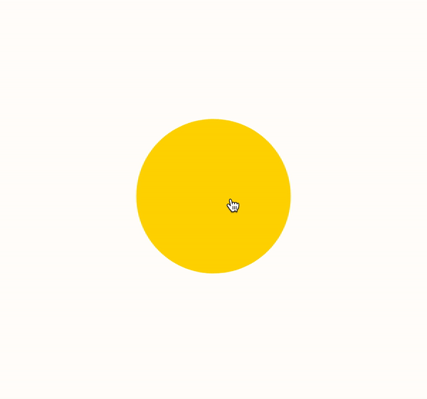  
Continuing on SVG and thought I'd start looking at how to animate SVG. There's SMIL (Synchronized Multimedia Integration Language) which looks interesting as well, but I wanted to see what I could do with JavaScript. If I understand it correctly, this is a job for a library, but I wanted to try with JavaScript simply because I need to learn JavaScript functions, and what I'm having in mind are very basic animations / transformations. Spent most of the day Googling and staring at JavaScript examples. Finally I found one here at [w3.org](https://www.w3.org/TR/SVG/script.html#EventAttributes) that does what I want, which is an element that's animated when it's clicked on (not when clicking a button). Hope I'll be able to make something from this.
### Day 78 - Wednesday 28.03.2018 - SVG clip-path Easter bunny
  
It’s Easter holiday week, and in my mind, Easter is connected with a blue sky more than anything else. So here’s my Easter bunny in a new version. I’ve decided I want to understand clip-paths better before I work more on masking. When I set up today’s project, it was clear that it’s a good decision since I still get a bit confused by the code. For this one, I wanted to use grouping. I couldn’t make it work in a way that mede sense, so I guess I still don’t quite understand how different parts of the code work together.
### Day 77 - Tuesday 27.03.2018 - A small JavaScript variables victory
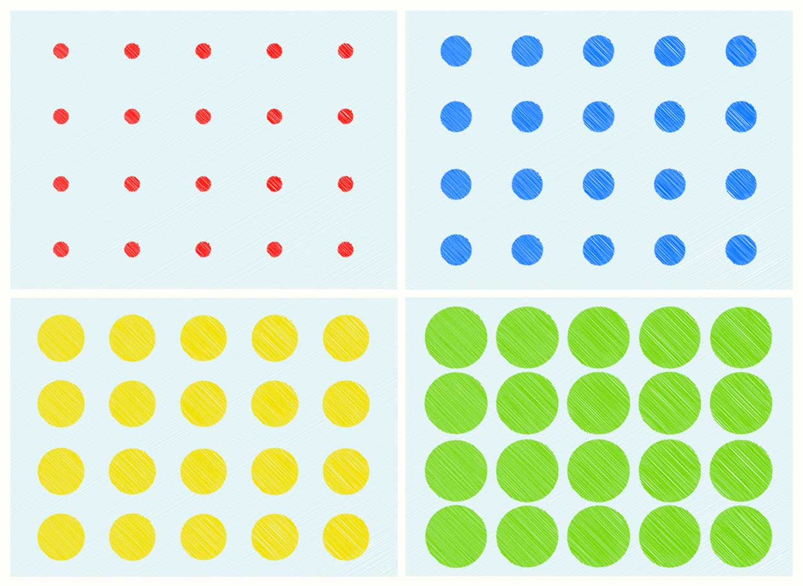  
Alhough I feel like I’ve made very little progress the other times I tried, I know I need to keep working on JavaScript. So this morning, I dug out KhanAcademy’s JavaScript course. I’ve done most of it before, but I didn’t really understand how to use the course content outside the KhanAcademy environment. But this time, when rewatching the tutorial on changing sizes with variables, I immediately thought: I should be able to use this with Rough.js; the library I wrote about a few days ago that makes JavaScript Canvas drawings look hand-drawn.

So I opened my editor and played with changing sizes and colours with variables. And after watching the next tutorial, I tried changing the relative x and y positions of the circles with variables and a bit of math, which totally worked. The JavaScript newbie was very happy!

üìï Today's resources:  
♦️ [Intro to Variables on Khanacademy](https://www.khanacademy.org/computing/computer-programming/programming/variables/p/intro-to-variables) 
♦️ [More on Variables on Khanacademy](https://www.khanacademy.org/computing/computer-programming/programming/variables/p/more-on-variables)
### Day 76 - Monday 26.03.2018 - SVG masking
  
Started on SVG masking, made this, and I have no idea how. Well, maybe I'm exaggerating a bit, but I'm a bit confused by the behaviour of the gradients here. It's of course a bit ambitious since I'm both using gradients, opacity, images, and text, so I think I need to break this down some...
### Day 75 - Sunday 25.03.2018 - Gradients and clip-paths
Was inspired by an artwork of [Andy Gilmore](http://www.agilmore.com/info) this morning, found on the brilliant [Twitter account by Maria Linares Freire](https://twitter.com/LinaresFreire). So I made a coded version with Grid and gradients. I used a colour picker tool to get the right hues.

Original:

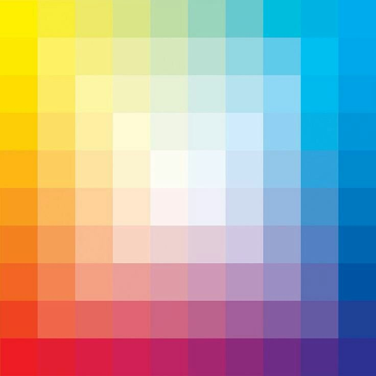  
Coded version:

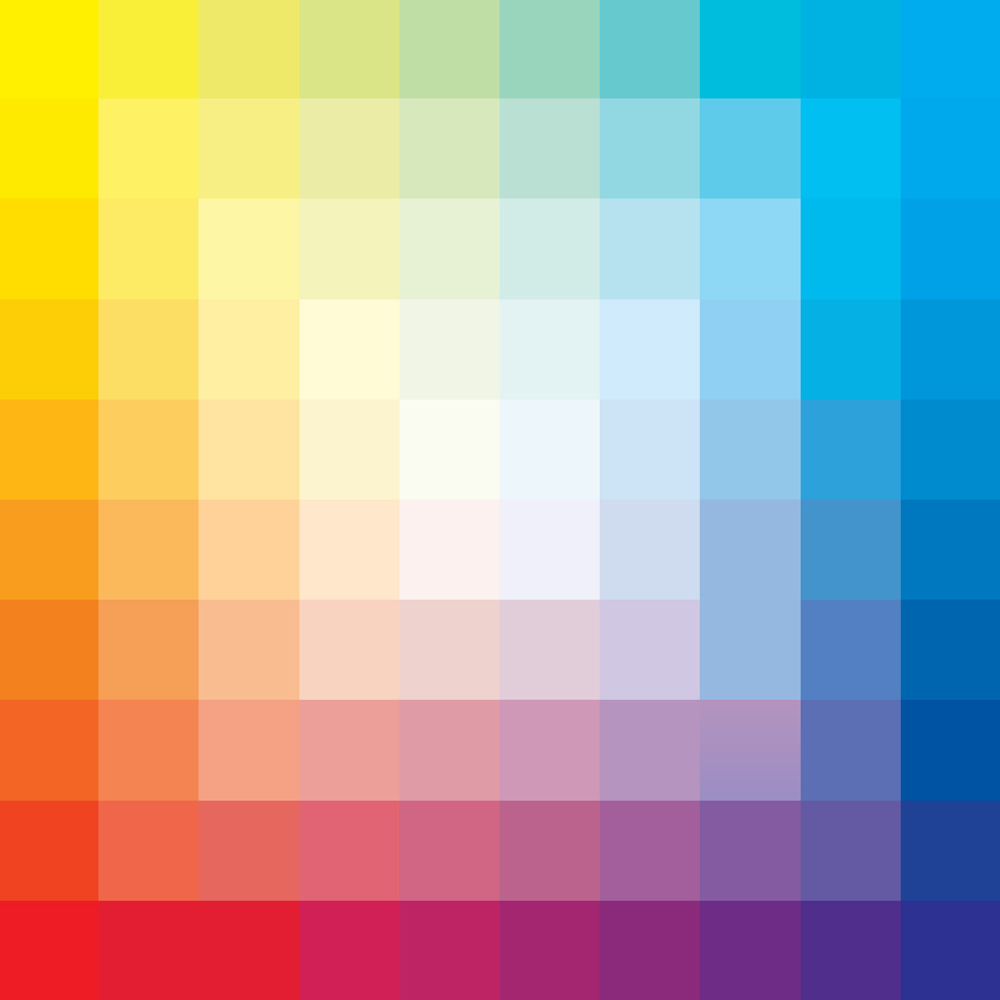  
The code itself looked super pretty in the editor with all the colour highlighting! Then my next project: it’s my day 75 of the #100DaysOfCode challenge today, so I wanted to make a drawing of a 75% complete cirlce. I decided that I’d use svg clip-path since that’s what I’m working on right now. I haven’t practiced writing arcs yet, but I found a nice example on [w3.org](https://www.w3.org/TR/2001/REC-SVG-20010904/paths.html), analysed the code, and managed to figure out how most of it works. And then I realised I could use the code from my previous project: by compressing the code online, I got a nice colourful result in the editor, took a screenshot, and voilà, image for the clip-path.

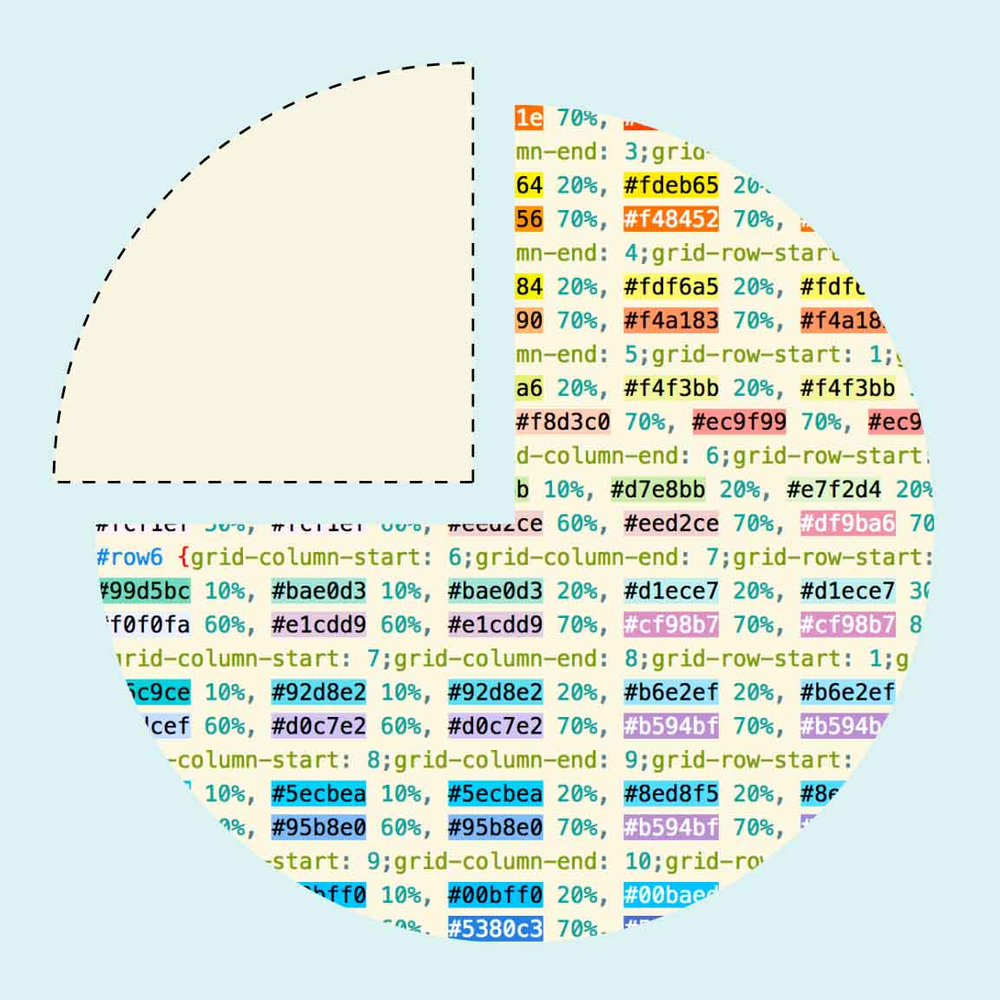  
.
### Day 74 - Saturday 24.03.2018 - SVG clip-paths with text
Made a couple things with my old Instagram photos and SVG clip-path text. I love SVG so far üòç So many possibilities are opening up with layers, clipping, opacity / fill-opacity. Also learnt that we can use clip-paths in CSS.

  

📕 Today’s resource: [Sara Soueidan’s blog post on SVG clipping](https://www.sarasoueidan.com/blog/css-svg-clipping/)
### Day 73 - Friday 23.03.2018 - Colour picker!
Exciting day. I've been curious about how to implement a colour picker ever since I saw it on the website of [Nika Zawila](http://nikazawila.com/), and today, I found a nice tutorial on MDN üòç Made this dress colour changer üëó  
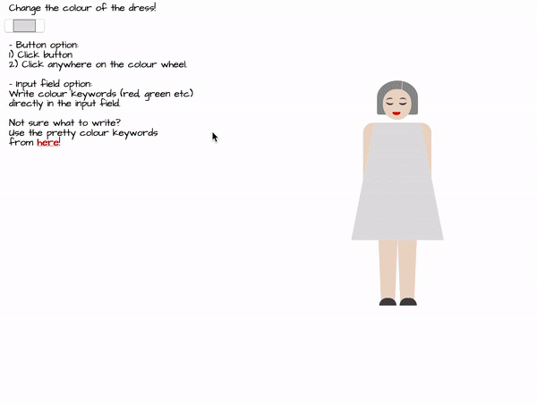  
I had to make a couple changes to the JavaScript code to make it work on the dress instead of on text. So happy when it worked! I keep hitting the wall when I try to make progress with JavaScript, but it seems I'm learning a tiny bit after all. 💪🏻

Update: It seems clip-path doesn't work in Internet Explorer, and it's only recently that it got supported in Firefox. I got my bf to test the colour picker project on a work computer, and the girl's dress becomes totally square üò≠ So this is knowledge for the future, I guess. But the colour picker works.  
➡️ Try it [on CodePen](https://bit.ly/2uflSzO)  
üìï Today's resource: [MDN colour picker tutorial](https://mzl.la/2DOLQK3)
### Day 72 - Thursday 22.03.2018 - Letter inspiration
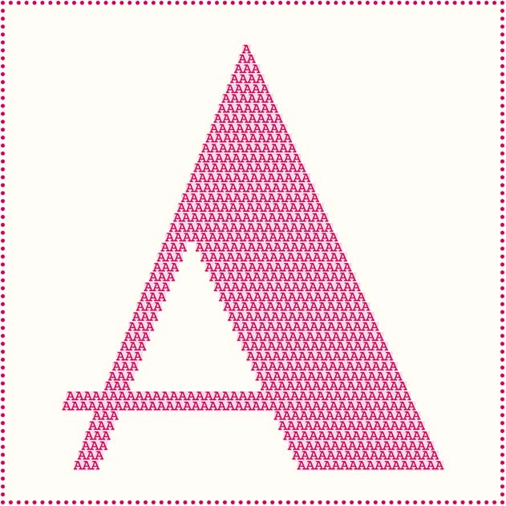  
Was inspired by Sophie Brown’s [Instagram account](https://www.instagram.com/sophie_elinor/) today, so I coded this A as a new desktop wallpaper for my laptop. It's based on one of my favourite Google Fonts, [Limelight](https://fonts.google.com/specimen/Limelight), designed by Nicole Fally.
Afterwards, I continued with the SVG tutorials on MDN. Started on clip-paths, which seems to be a CSS thing that I overlooked a bit. Looking forward to continuing with that tomorrow, because it'll also be super useful for my CSS drawings as well.
### Day 71: Wednesday 21.03.2018 - SVG patterns
Practiced SVG patterns. Made two: 
üå∏ a new cover for my Twitter profile 
üê∞ an Easter-inspired bunny pattern which you can find [here](http://bit.ly/2DK2MkW) on CodePen and which also became a CodePen Picked Pen today!

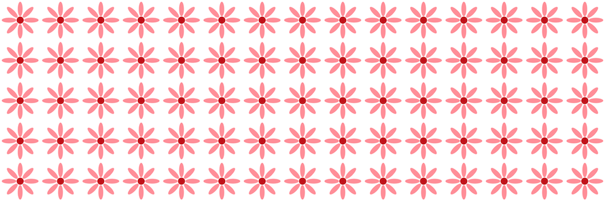  
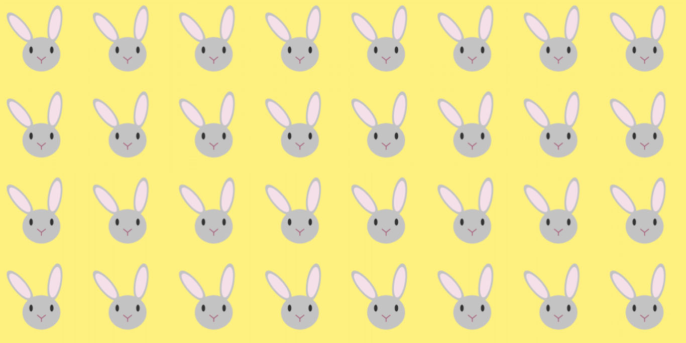  
I had fun making these patterns. I think I understood the concept basics, so I'm moving on to the next SVG tutorial on MDN, which is text.
### Day 70: Tuesday 20.03.2018 - more SVG
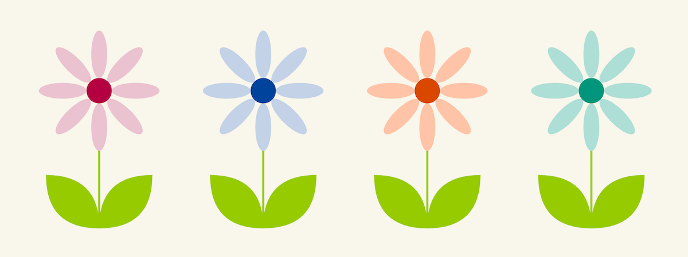  
First: made multiple-coloured versions of SVG flower with `<use>`. So useful (pun not intended)! But I need to get more experience in how to combine it with `<g>`, `
        </defs>

        <rect x="300" height="100" y="10" width="100" id="RectStyle"/>

👉🏻 I've also seen the style tag outside `<defs>`, and written both with and without **type="text/css**. Will have to look more into this to see if there's a difference.

**4) In an external, linked stylesheet**

HTML  
`<rect x="450" height="100" y="10" width="100" id="RectStyle"/>`

CSS stylesheet 
`#RectStyle {
    stroke: rgb(175, 0, 0);
    fill: rgb(226, 199, 199);
    stroke-width: 4;
}`

👉🏻 3) and 4) have identical syntax because both link to CSS that's placed elsewhere.

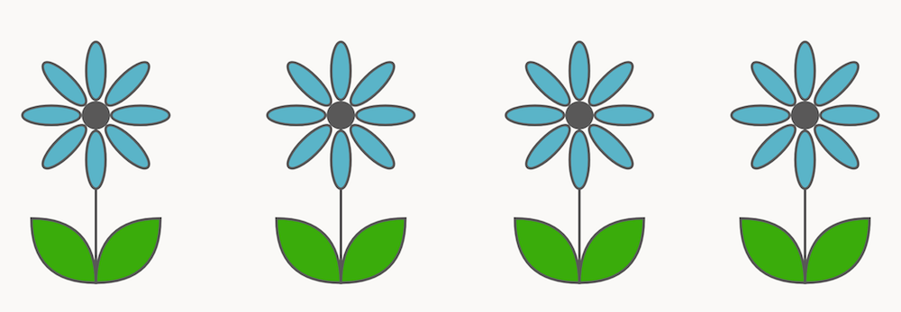  
Next, I read an article by Sara Soueidan and started learning how to reuse elements with the `<use>` element. This is handy if you want to repeat elements. Next: learn about styling this element.

üìï **Today's resources** üìï 
♦️ [MDN Web Docs on CSS](https://developer.mozilla.org/en-US/docs/Web/SVG/Tutorial/Fills_and_Strokes) 
♦️ [Sara Soueidan's article](https://www.sarasoueidan.com/blog/structuring-grouping-referencing-in-svg/)

### Day 68 - Sunday 18.03.2018 - SVG paths
  
Started learning about rotating of SVGs. Needed help from my house teacher (the bf) to understand how to position the leaves. Am still not sure I'm getting it 100% yet, but I guess I will after having applied it a few times. Now I have an SVG cover for Twitter, but Twitter doesn't handle solid reds very well so I had to change the colour scheme üò≠ Anyway, I've learnt heaps about SVGs already so will continue working my way through the MDN documentation.

### Day 67 - Saturday 17.03.2018 - SVG paths
  
Worked on SVG paths. Learnt about cubic and quadratic curves and used quadratic curves to make the leaves in the test drawing. I also need ellipses for petals and spent some time trying to make them with cubic curves since they need to have different angles in the drawing and I thought I couldn't do that with ellipses. But after some Googling I learnt that you can apply transformations in the SVG code in HTML. So then I can use transform: rotate on the ellipses. Seems like the easiest solution, although I need to understand which axis the rotation happens around.

Conclusion: this is hard! And even as a Inkscape total beginner I could make this a lot faster in Inkscape. But I want to learn how to code basic shapes to I understand better how SVGs work. And I like a good challenge 🤓

üìï Today's resource: [MDN Web Docs on SVG Paths](https://developer.mozilla.org/en-US/docs/Web/SVG/Tutorial/Paths)
### Day 66 - Friday 16.03.2018 - Starting SVG
I’ve wondered WTH :nth-child and similar actually means, so I started the day with Googling it and reading a couple articles. Got the main concepts, will of course have to get back to it.

I’ve been thinking that it’s time to sit down and read the whole CSS section on MDN. As a super eager code newbie, I discover new stuff all the time, and it makes me feel like a child in a toy store. There’s so much fun and useful stuff to learn, and it’s very easy to start jumping all over the place, trying to learn everything and at the same time follow up on own creative ideas. I do learn heaps of stuff from trying out the things I stumble upon and from making my own projects, but what I learn feels a bit arbitrary.

Anyway, since I played with Canvas and Rough.js yesterday, I decided that it’s time to tackle SVG, which I’ve mostly admired from afar. Used MDN Web Docs, made a playground and went through the basic shapes. I’ll have to practice polygons more because I get slightly confused by the coordinates (even though I do understand what they mean). Maybe drawing on graph paper will be useful.

📕 Today’s resource: Useful pseudo-class overview at [MDN Web Docs](https://developer.mozilla.org/en-US/docs/Web/CSS/Pseudo-classes).

üéß Also added my DJ controller CSS picture [on CodePen](https://codepen.io/Antzee/full/jzrJvx)
### Day 65 - Thursday 15.03.2018 - Drawing with Rough.js
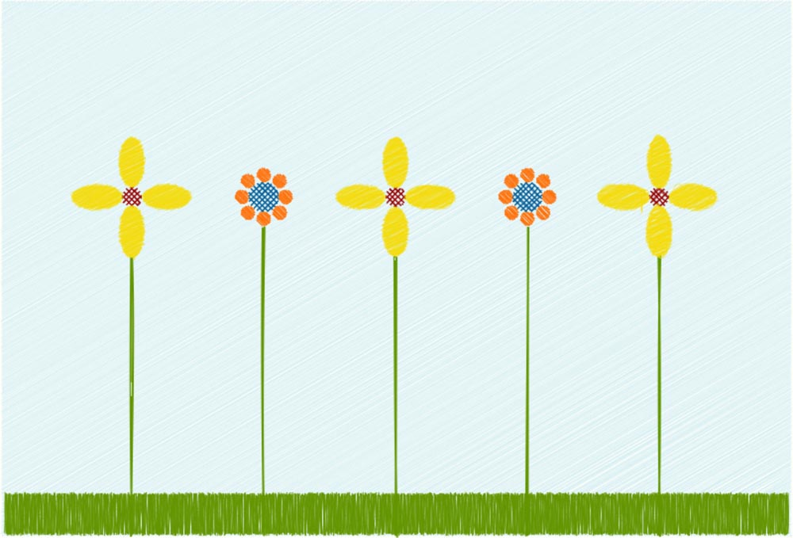  
Discovered Rough.js, a Canvas-based library that makes JavaScript Canvas lines and shapes look like they're drawn by hand. I never really used Canvas since I could do my stuff with CSS, but this library was a nice addition! It's useful for me on several levels: it made me do something JavaScript based, and I got to repeat the Canvas coordinate system. I also see that this library will be even more useful with SVG, so I guess it's time to learn more about that.
  
üìï Today's resource: [Rough.js](https://roughjs.com/). Found via [Speckyboy](speckyboy.com).
### Day 64 - Wednesday 14.03.2018 - Tango website + JavaScript functions
Continued with my Argentine tango website, but since I wanted to learn something every day during the challenge, I also went back to revise JavaScript functions. To be honest, they still don't make much sense, so I'll be doing some deep diving on this. It's clear that one forgets very quickly what one hasn't used regularly, and probably even faster if one hasn't got a deep understanding of the topic in the first place.üßê
### Day 63 - Tuesday 13.03.2018 - Tango website work
Took up the Argentine again. As I've mentioned before: I also should do something that I learn from every day during the challenge, but today, I just repeated how to make tables in HTML (which is useful, of course).
### Day 62 - Monday 12.03.2018 - JavaScript practice
Was away for the weekend. Travelled back today. Used my JavaScript practice sheet to practice writing JavaScript variables on the flight.
### Day 61 - Wednesday 07.03.2018 - DJ controller progress!
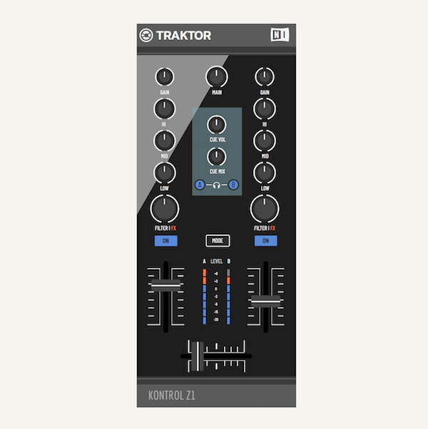  
Finished the drawing of the DJ controller. Now it's snugly packed for my weekend trip to Bergen, where I'll be DJing and dancing.
### Day 60 - Wednesday 07.03.2018 - DJ controller progress!
  
The single div experiment became a multiple div experiment, as I knew it would. It's coming along nicely, and I've learnt a lot about box-shadows and linear-gradients. Having transparent parts of the linear gradient opens some new possibilities that I hadn't thought of before. Hope to finish tomorrow before I leave town for another tango weekend.
### Day 59 - Tuesday 06.03.2018 - Single div experiment!
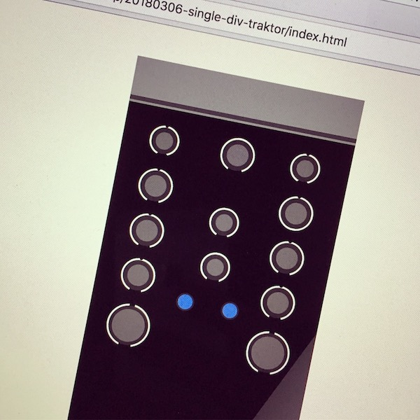  
Today, I discovered that my code drawing of my Sennheiser headphones was a picked pen on CodePen. 🤗 This made me start thinking about DJ equipment and then I thought that my software controller might be a good subject for a single div drawing. This is the result so far. It's one div with :before. So far I didn't use :after but I don't think I'll be able to do all the details with just one div - but most of it should be possible. Anyway, it's fun to make and great practice. I'm using box-shadows A LOT. 🤣
### Day 58 - Monday 05.03.2018 - Single div!
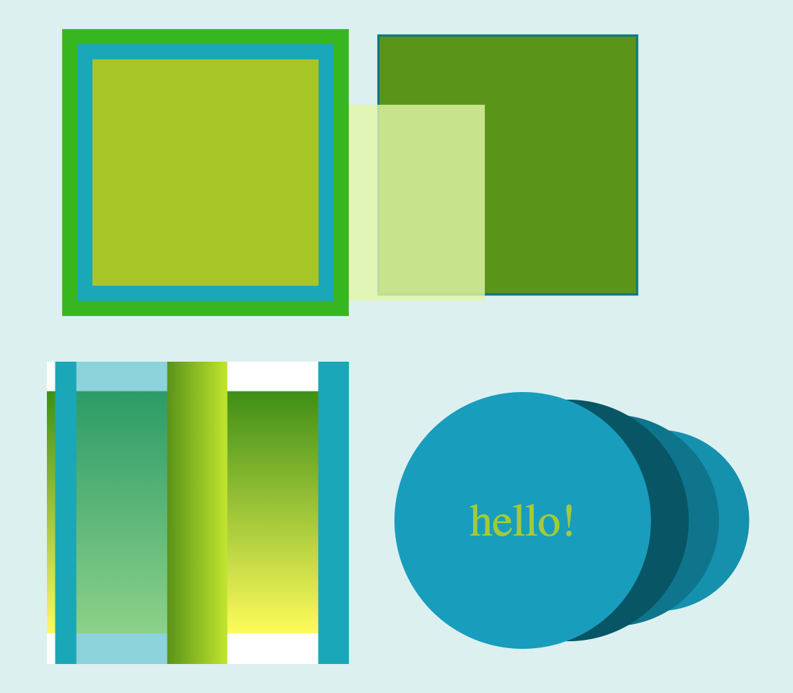  
Took yesterday and the day before off because of a tango workshop weekend (taking classes with a visiting teacher couple and DJing a six hours set on Saturday night). I don’t feel bad for breaking the streak, though; I’m very enthusiastic about coding and I usually do full days just because it's fun. I even forget to take breaks. Actually, I might need to do a "Not more than seven hours of coding per day including log and Twitter post" challenge.

Today, I discovered Lynn Fisher’s project [A Single Div](https://a.singlediv.com/) and was awestruck. I then found [her article on Mozilla Hacks](https://hacks.mozilla.org/2014/09/single-div-drawings-with-css/) and realised how much can be done with, well, a single div. I never thought about adding more than one box-shadow, for instance, and I wasn’t aware of the possibilities of layering gradients and making parts of the gradients transparent, either. So overwhelmed by the options that I couldn’t think of what I wanted to make, so I just made a playground and messed around with the CSS. Looking forward to making more use of this!

Btw, having made the box-shadow poster the other day came in handy because I had learnt what I could do with the “spread” property.
### Day 57 - Friday 02.03.2018 - Box-shadow poster and braided pattern finished
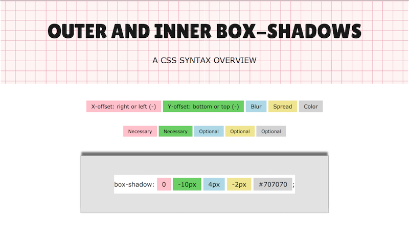  
I published the box-shadow poster on GitHub Pages today! You can find it [here](https://antzee1.github.io/Box-shadows). Like with the [JavaScript variables practice sheet](https://antzee1.github.io/Variables-cheatsheet/), I learnt a lot from making this poster: both about box-shadows, of course, but also about layout. Every time I set up a page, I get more confident with the layout tools. This time, I used Flexbox with a media query for small screens.

I also finished the project that started the whole box-shadow thing this week. I used CSS Grid and a combination of inner box-shadows and gradients for the effect, and also tweaked the width/height and positioning a bit so it looks like each ribbon fits under the other. It was a total nightmare to figure out everything, but am super happy with how it turned out.

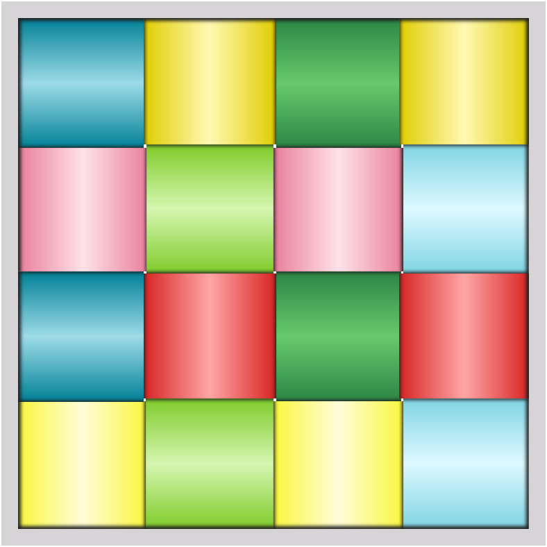  
### Day 56 - Thursday 01.03.2018 - More box shadow stuff
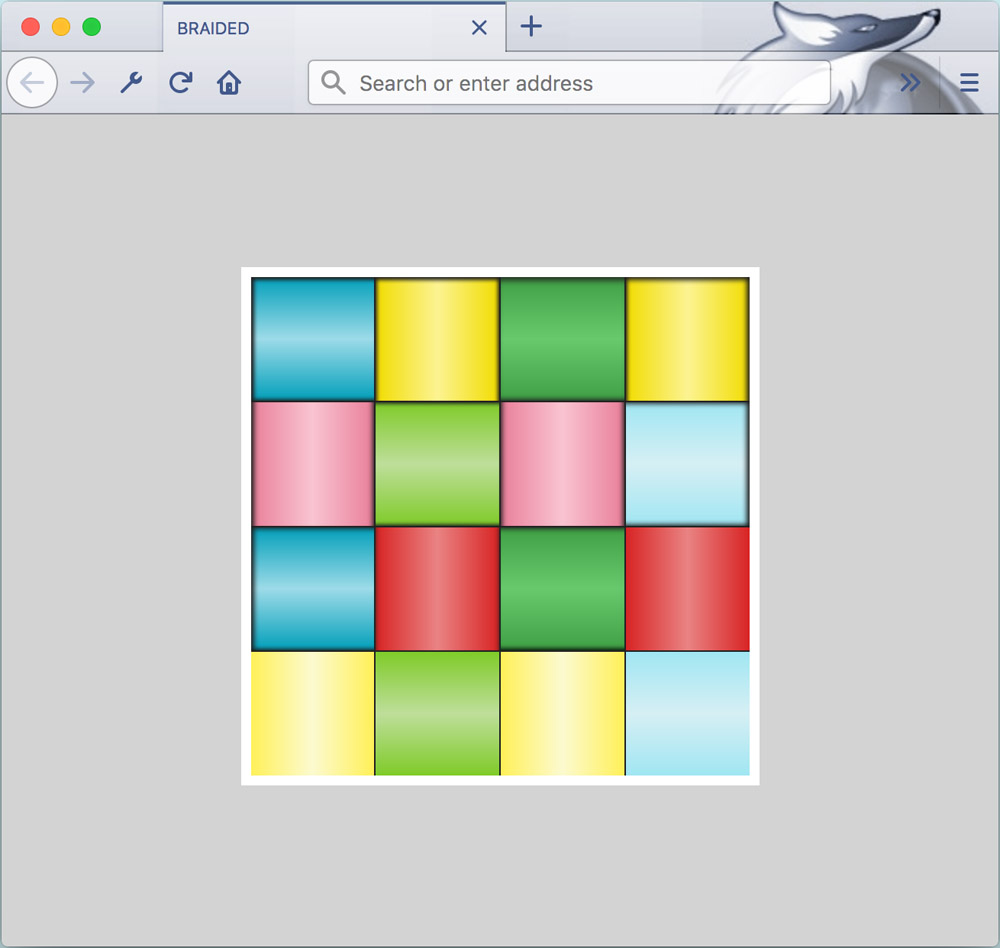  
The box-shadow syntax sheet is done, just need to figure out a detail. Also returned to the experiment I started on Monday, since I understand the box-shadows syntax much better after making the syntax sheet. But this one is tough! I've almost finished it, though. In the end I decided I needed to only use inset box-shadows since the outset ones look a bit different, plus the outset ones also would involve some serious z-index headache. I tried, but couldn't figure out another simple solution.
### Day 55 - Wednesday 28.02.2018 - Busy day!
Super busy day, but managed to squeeze in a bit more work on the cheat sheet.
### Day 54 - Tuesday 27.02.2018 - More on the CSS Box-shadows cheat sheet
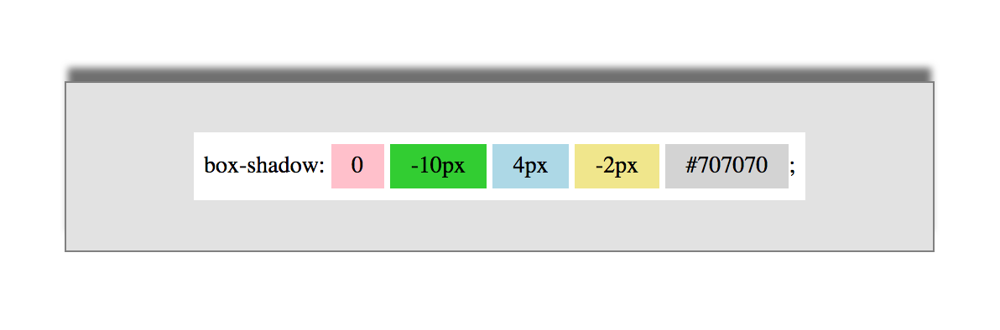  
The box-shadow cheat sheet is coming together. Layout is done + most of the examples. Just need to add the inner shadows examples, and then there's always a bit of OCD proofreading. It's super useful to make this! In addition to being forced to study the box-shadow property, I'm also practicing CSS Grid and Flexbox, and I learned to use span in the HTML code so I could style words separately.
### Day 53 - Monday 26.02.2018 - CSS Box-shadows
Started the day making another CSS Grid template-areas experiment. I needed the box-shadow property many places in the pattern I had made, and kept getting confused by how the different box-shadows influenced the finished result. So in the end, I just decided that I needed to understand/remember the syntax properly, so I started making an overview which I will share tomorrow. Am using Flexbox and Grid template-areas so got to practice that as well.
### Day 52 - Sunday 25.02.2018 - CSS Grid: template-areas property
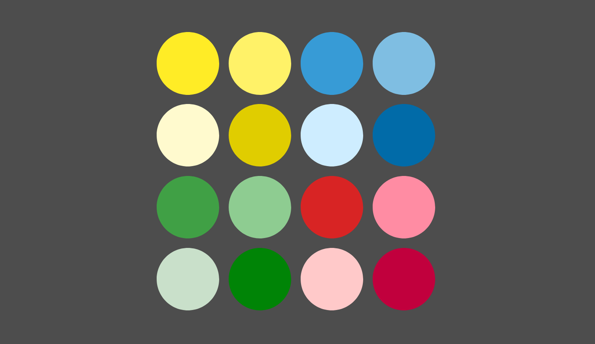  
Today, I made a playground to try out CSS grid-template-areas. It’s a nice way of visualising the layout in the CSS code.
The playground is [here on CodePen](https://codepen.io/Antzee/full/mXGZLJ/).

📕 Today’s resources: 

♦️ [CSS Grid course on Scrimba](https://scrimba.com/g/gR8PTE) 
♦️ [Grid by example tutorial by Rachel Andrew](https://youtu.be/RssSS_xhv2E)
### Day 51 - Saturday 24.02.2018 - JavaScript variables syntax cheat sheet published + a cute girl animation
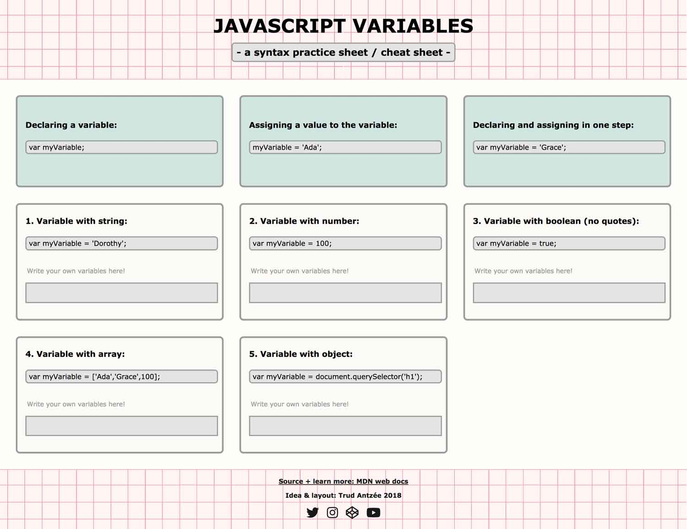  
Pulished the JavaScript variables syntax practice sheet / cheat sheet. It's [here on GitHub](https://antzee1.github.io/Variables-cheatsheet/)! This was fun to make, will be interesting to see if it's useful for me or others.

Also made this girl here. She's made from only cirles, and the gif is made with Gifsky, which is a new gif-application for Mac desktop made by Sindre S√∏rhus.

  
### Day 50 - Friday 23.02.2018 - JavaScript variables syntax cheat sheet
Finished my first JavaScript variables syntax practice sheet / cheat sheet. Just need to talk it over with my house teacher (the bf) before sharing, in case I overlooked / misunderstood something. It was super useful for me to make this; I’ve had trouble holding on to information about the different data types we can use in variables. But now I’ve used more than one part of my brain to process the information, I think it’ll stick better.

For this layout, I used CSS Grid with the auto-fit property, which worked nicely for my text-only design once I tweaked font sizes and div sizes some. Also supplied with media queries for the smallest screens, was happy to get to revise that. Maybe it’s me who’s weird, but I find it oddly reassuring to see how everything resizes nicely to the browser window. 😍

Also used CSS Variables in this project. How pretty isn’t the colour preview in Atom?

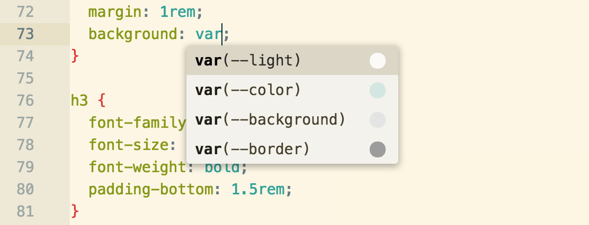  

📕 Today’s resources:

♦️ Mozilla’s MDN web docs has a well-written article on JavaScript variables basics [here](https://developer.mozilla.org/bm/docs/Learn/Getting_started_with_the_web/JavaScript_basics)

♦️ [this nifty page](https://mothereff.in/js-variables) checks your variable name to see if it’s valid.

Also: Oh Gosh am already halfway through the challenge! I think I would have coded every day even if I didn't do the challenge, but it’s fun presenting your work in public every day - it could be that it pushes me to do a bit more, or learn a bit more, or even get more ideas.
### Day 49 - Thursday 22.02.2018 - back to JavaScript basics
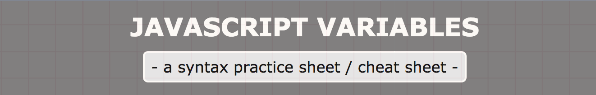  
Based on yesterday's thoughts, I wanted to make sure I do something that I learn from every day. I still haven't been able to get any noticeable progress with JavaScript, and I keep falling off every time I try. The reason is partly that I really struggle with the syntax. So today, I started working on a small cheat sheet. They probably already exist in abundance online, but I believe one learns more from making stuff oneself - this is at least true for myself. It's not done yet, but in the meantime I did learn something: not JavaScript since I mostly worked on the layout today, but the CSS Grid auto-fit, which is perfect for this layout.
### Day 48 - Wednesday 21.02.2018 - The day I coded without coding?
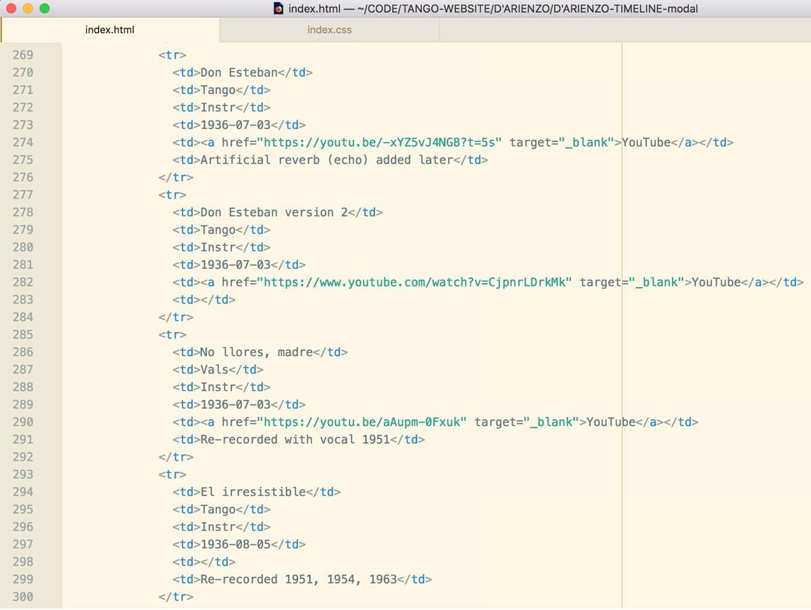  
Added discography content to my music website, but realised that even if I worked in the editor, maybe I wasn’t doing actual coding. I’d define it more as music work: checking recording versions, deciding where to add listening examples, etc. So today I didn’t really feel I learnt something new about code. There’s still a few day’s worth of work before this part of the website is done, and I don’t want to spend several my 100 Days Of Code only on this! The point of doing the challenge is to learn more about coding. So tomorrow I plan to do something else in addition to website work.
### Day 47 - Tuesday 20.02.2017 - Small stuff
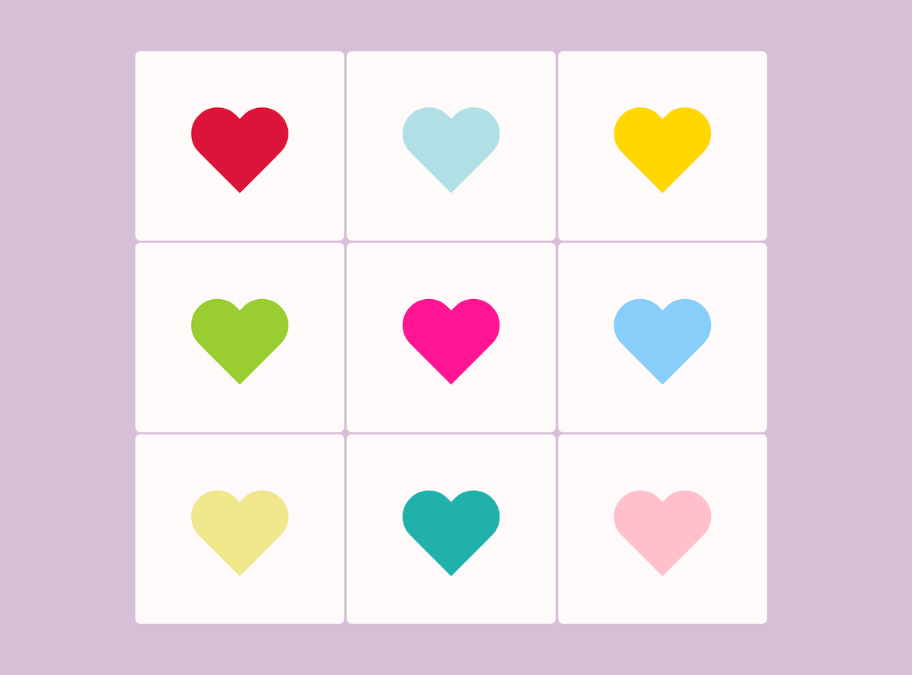  
Today: made my first submission to Creative Coding Club. ✅ This month’s theme was Candy Hearts. I had already made it earlier this month (I wrote about it on 13. February), but I kept it because I wanted to do some fancy stuff with it. Today I decided that I’ll just keep it simple and put the focus on the CSS variable fonts, which was what initially inspired the design, so I just tweaked the colours a bit more.

➡️ You can see it [here on CodePen](http://bit.ly/2ocFy1L) - and you can play with the colours in my code. And yay, it made it to the front page of CodePen today!

➡️ Today’s resource: I’m a bit smitten with colour keywords. Some of them are really poetic, like “ghostwhite” and “lavenderblush” and “oldlace” (the last one is my personal favourite).  Article + full keywords list on [Mozilla’s MDN Webdocs](https://developer.mozilla.org/en-US/docs/Web/CSS/color_value).

I also tried to fix a post heading margin annoyance I’ve been having in the 100 Days Of Code log layout - too much space between the heading and the actual post. Looks a bit better now.

Other than that, I started adding links to YouTube listening examples on the Di Sarli discography tables. Only adding a few per year for now; can add more later. Lots of stuff on the tango website to do-list.
### Day 46 - Monday 19.02.2018 - Discography for Di Sarli
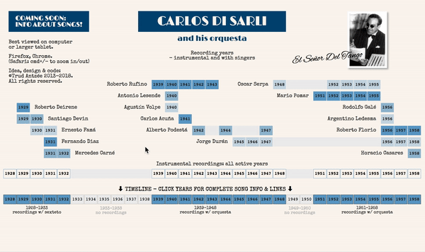  
Today, I applied everything I learnt yesterday - I added Di Sarli’s whole discography to his timeline; 30 years worth of recordings, divided into years, in sortable tables. Geek is happy! 🤓😍🤗
### Day 45 - Sunday 18.02.2018: Slow Sunday with tables.
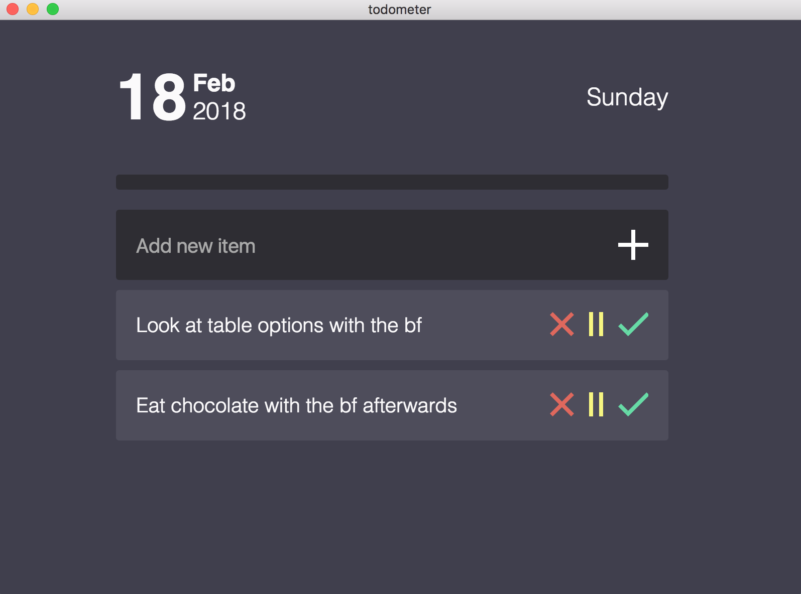
Today, my house teacher (the bf) helped me get the table-sorting JavaScript to work on multiple tables on my tango orchestra timelines. We also discussed ways of adding the discographies to the html files, and he suggested a method that saves loads of work by converting a spreadsheet to CSV and then the CSV to HTML code. Didn't write many lines of code but I did learn to use a CSV.
  
➡️ Today’s resource: 
♦️ [CSV to HTML online converter](https://codebeautify.org/csv-to-html-converter) 
♦️ Also: this [Todometer by Cassidy Williams](https://cassidoo.github.io/todometer/)
### Day 44 - Saturday 17.02.2018: Starting the tango website.
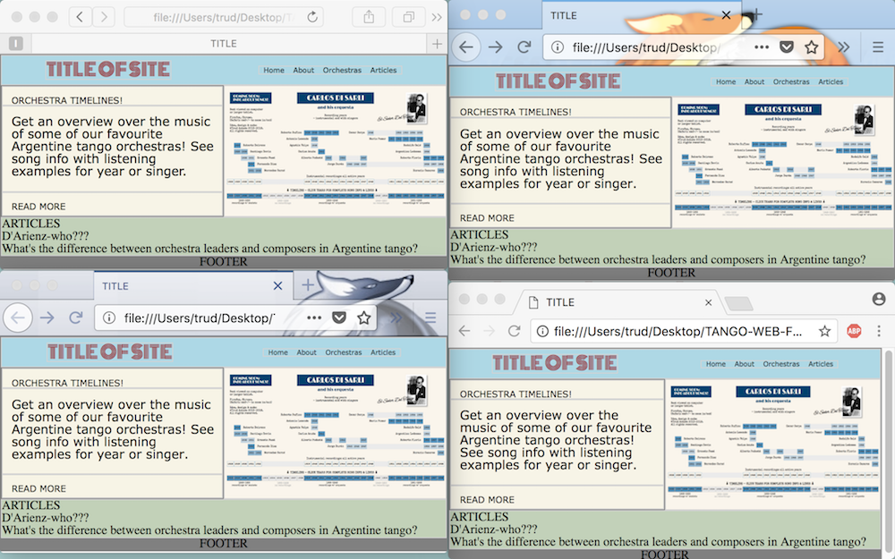  
Today, I started coding the tango website landing page. I’m using CSS Grid and Flexbox and am happy to see that I’m feeling far more confident with Flexbox than before. Here’s the page in three/four browsers (depending on whether you count Firefox and Firefox Developer Edition as one or two browsers). After a bit of agonising over the image size, everything now displays correctly and resizes nicely. Fonts are not done yet.

Of course, it looks super ugly right now because I only worked with the layout. The contrasting background colours are kind of “support wheels” for me to see where the different sections begin and end. I’m looking forward to styling it later. Now I’m off to DJ tango!
### Day 43 - Friday 16.02.2018 Personal website progress
Started the day with changing some values in the code of my profile picture to see if it was possible to make my old code images responsive. It worked! So happy that I used % for almost the entire drawing when I initially made it, and not px. I considered using the code vesion on my website instead of PNGs: it would be kind of nerdy fun to use only code, and maybe it also would reduce loading time. But I decided to use the PNG versions after all because then I don’t have to worry about pictures looking weird on other devices. I can check browser compatibility on the properties I use, and I can prefix where necessary, but I still don’t know enough about how other computers’ different display settings might display the images. And already there are some tiny differences between the browsers (like Chrome makes it look like the avatar-me rolls her eyes. Which admittedly happens from time to time 🙄)

Rest of the day: coded the rest of my website, actually. The decision I had to make was whether I should to put everything on the front page, like a scrollable thing, or a more classic solution, which is to have separate information on separate pages. I decided on separate pages, at least for now. If I change my mind, I’ve still done most of the work.
### Day 42 - Thursday 15.02.2018 Personal website detour
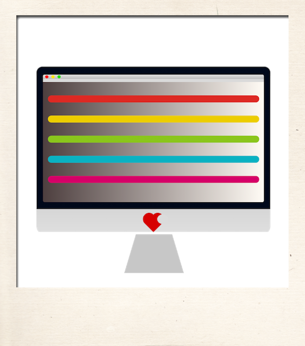  
I've gotten stuck on my personal website - not the technical parts but the design, which I didn’t really feel was going anywhere. But then I got a new idea for the design. I started thinking about it after I went to bed last night, slept badly because was trying to figure out how to make it, got up, tried to make it, and realised I didn’t like the layout at all. So much for the brilliant ideas one gets when one ought to sleep. But then I got another idea, super simple and no fuss. I’ve almost finished the front page, and I really like it and am going with that instead. It does involve PNGs with transparent backgrounds so it’s still a little bit fancy, and I get to use some of the images I’ve coded that I’m quite proud of.
### Day 41 - Wednesday 14.02.2018 Making tables in HTML
 
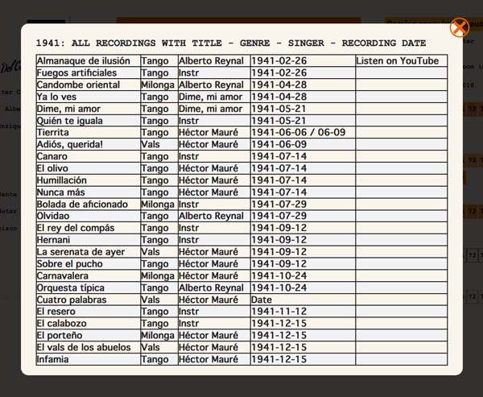
  
Today, I added the modal window code to the second timeline (D’Arienzo) and started adding song info for the song lists in the modal windows. It wasn’t super easy to get a quick overview on a list with lots of information, though, so I learnt how to make tables in HTML and decided to use that. Next challenge: make the tables sortable with JavaScript.
  
📕Today’s resource: 
➡️ How to make tables in HTML [here on W3schools](https://www.w3schools.com/html/html_tables.asp)
### Day 40 - Tuesday 13.02.2018 CSS Variables FTW!
 
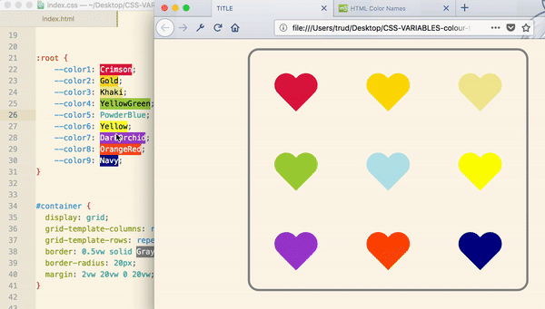
  
OMG I LOVE CSS. I’ve changed the colours on my orchestra timelines several times because I need to try out different colour combinations - I want the colours to be functional and also pretty. But I’ve spent a lot of time changing the colours on each individual div since I haven’t started learning SASS or similar. But today I saw a tweet mentioning CSS Variables, and I did a Google search and found an article by Violet Peña and almost fainted with happiness: once I decide which divs are having the same colour, I can make a variable and afterwards I only have to change the colours one place - the :root section of my CSS - instead of looking through the whole CSS file and replacing colours everywhere.  
Of course, I had to make a playground to try it out! It also inspired a side project which I worked on today. More on that later - it needs to be finished by the end of February so I’m keeping it for a while to see if I want to change something.  
CSS Variables need fallback for older versions of browsers (and of course the pesky IE). But it’s time to learn that as well, and it’s much less time-consuming to add the fallback colours after one has made a final desicion about the colours.

üìï Today's resources:üìï  
➡️ [The article on CSS Variables by Violet Peña](https://vgpena.github.io/winning-with-css-variables/)  
➡️ Basic CSS Variables syntax with Try It Yourself-examples [here on W3schools](https://www.w3schools.com/css/css3_variables.asp)
### Day 39 - Monday 12.02.2018 Tango website project: modal boxes!
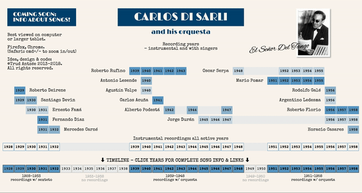
  
Started looking at how to make modal boxes to display song information for each year on the tango orchestra timelines. I found two options that involved JavaScript and one that is pure CSS. I dissected both JavaScript options and almost made it work, but had some problems with since I don't know how to apply the code to more than one div.  
So I'm using the CSS option for now, and later I'll figure out if there's a way of doing it with JavaScript (and also without repeating lots of code) (I'm sure there is). Also need to find out what's best for fast page load; CSS or JavaScript. Am super excited about the CSS version, though. Learnt a bit about modal boxes today, and some small CSS things as well, like putting overflow: scroll on the modal window.  ‚úÖ 

➡️ Modal box resources: 
-JavaScript options: [this](https://www.w3schools.com/howto/howto_css_modals.asp) and [this](https://www.w3schools.com/howto/howto_js_popup.asp) from W3schools 
-Pure CSS option [from webdesignerdepot.com](https://www.webdesignerdepot.com/2012/10/creating-a-modal-window-with-html5-and-css3/)
### Day 38 - Sunday 11.02.2018 Tango website project: tweaking.
 

  
Changed the colour scheme on the Di Sarli timeline + tweaked the layout some more so it corresponds better with the D'Arienzo one. Also checked details in all browsers and noticed that Safari zooms the page with cmd+/- (Firefox and Chrome doesn't). So put a couple browser & viewing suggestions on the page. Rest of the day: cleaning up code. üò≥
### Day 37 - Saturday 10.02.2018 Tango website project: part 1 second orchestra finished
 

  
First part of the D'Arienzo timeline is done! Today, I added a div for every year of instrumental recordings (41 divs; almost all recording years). So now everything is ready for next step. The idea is to make every year clickable, with a pop-up window with information of all the songs that were recorded that year + listening examples. Also tweaked the colours a bit, and cleaned up my CSS file by giving most Ids a class for the properties that are the same for all Ids (like fonts). Spending a bit of time on this so I have better habits for next orchestra timeline. 

Now: off to DJ at an Argentine Social event. üéßüéµ 
### Day 36 - Friday 09.02.2018 Tango website project: second orchestra almost done

  
Finished the main layout of the D'Arienzo timeline. Happy that I could fit in all the singers and years in a logical visual system. Also decided against the horizontal scrolling, so I changed all the years from four digits to two digits so each square would take up less space without using too small fonts. Now the page fits nicely on my 13" Macbook Pro screen.  
Am still having a bit of trouble with getting a horizontal scrollbar when I resize my browser. I don't know why, but it could be because the amount of divs with text inside - the scrollbar appears at a smaller browser size if I use a smaller font size. Also cannot control margins on this project. Minor problems that I guess I'll understand later on! 🤓
 
### Day 35 - Thursday 08.02.2018 Tango website project: next orchestra in progress

  
I decided yesterday that in addition to Di Sarli, I’m going to do three more orchestra timelines so I have The Big Four of tango music. First step will be the actual timelines (later I’ll add more details and clickable content). So today I started the timeline of D’Arienzo’s orchestra. It was a bit of a puzzle to figure out the layout because this orchestra recorded for 40 consecutive years so it doesn’t fit on one page like Di Sarli’s does, so we need horizontal scrolling to make space for a big enough font size. This timeline format only works on a computer or a big tablet; a version for smaller screens will have to look very different.

These aren't the colours I'll be using. I’m thinking of doing monochromatic colours since I’m doing more than one orchestra - and monochromatic is also better for people who have different types of colour blindness.
  
### Day 34 - Wednesday 07.02.2018 Tango website project with CSS Grid: first part done!
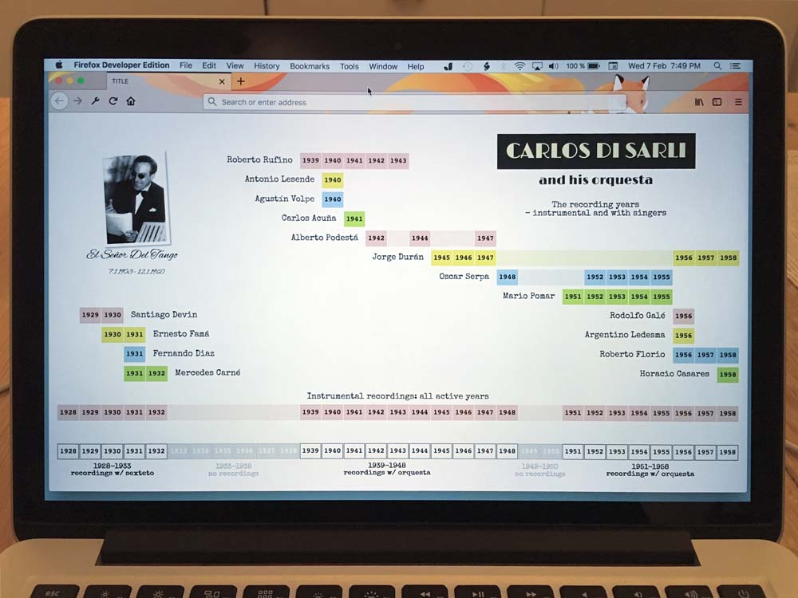
  
Finished the first part of the Di Sarli timeline chart. So far, I'm basically just translating my old work into code - next steps will be more time-consuming. But it's great practice, and it's very exciting to do something for tango! ❤️
  
### Day 33 - Tuesday 06.02.2018 Tango website project with CSS Grid
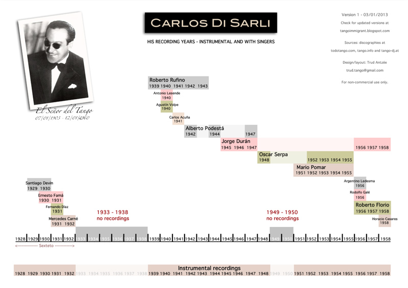
  
Back from a lovely Argentine Social Tango weekend abroad and started a new project for my future tango website: a coded version of the chart in the picture. I made the chart a few years ago - back then, I used Photoshop Elements, and now I’m excited to do it in code. So happy that CSS Grid exists, it’s perfect for this project! 😍   
üéµ Carlos Di Sarli was one of the most famous tango orchestra leaders in Buenos Aires. He was active recording from late 1920s to late 1950s, and we still dance to all of his music. The chart shows his recording history: which years his orchestra was active recording, and which years the different singers recorded with him. The idea of making this in code is to make the years clickable, with links to listening examples. Credit for the idea to make a code version goes to my house teacher (the bf), who also dances Argentine Social Tango.
  
### Day 32 - Thursday 01.02.2018 Just for fun: weekday calendar animation with CSS Grid
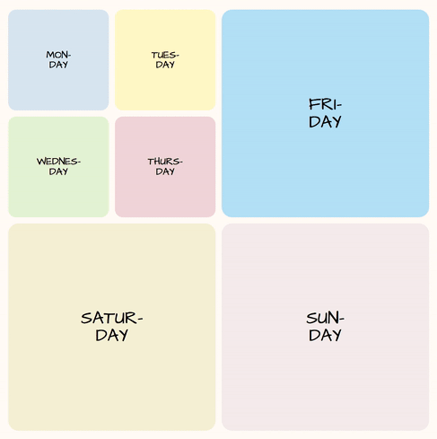
  
Today, I noticed how intense this month has been. I started 100 Days Of Code on January 1st, with a cold, and have been working full time the whole month on learning new code concepts. I wasn't up for doing anything super challenging today, so I made this to illustrate my week. It's CSS Grid, and it has a simple solution with an animated opacity property of the layer with the drawings. I didn't make the drawings, I just added colours to some Creative Commons-licensed icons I found on [The Noun Project](https://thenounproject.com). Here are the credits:  
[Computer girl](https://thenounproject.com/nookfulloption/uploads/?i=1493332) 
[Plane](https://thenounproject.com/monstercritic/uploads/?i=972456) 
[Dancing](https://thenounproject.com/leremy/uploads/?i=1258245) 

💃🏻 Tomorrow, I'm leaving for an Argentine tango marathon in Riga, Latvia. I don't feel bad about breaking my streak, though: I've been coding many hours every day in January, not just one hour like the challenge asks us to. Starting again after the weekend!
  
### Day 31 - Wednesday 31.01.2018 Log layout: complete layout with CSS Grid
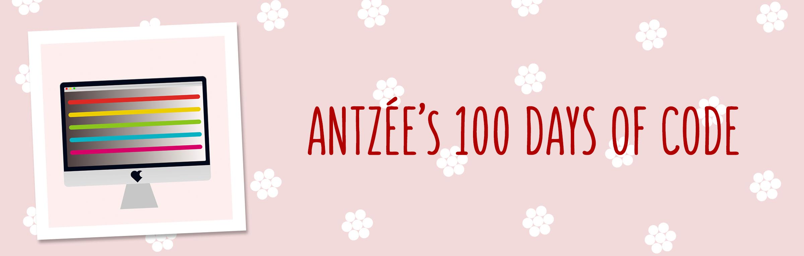
  
Coded my own responsive layout for my [100 Days Of Code log on GitHub Pages](https://antzee1.github.io/100-days-of-code/). My house teacher (the bf) had already set up the file structure for me on GitHub last weekend, but all the code is now me-made: a complete structure with CSS Grid. This log is only for 100 days, but it’s a good practice opportunity!

The log looks okay on my phone as well, although everything is naturally a bit on the smallish side even though I used calc() to make the text resize nicely. I guess it would be good to practice by making media queries with a different layout for small screens. I’m still super happy about today, just because of the fact that everything behaves as intended.
  
### Day 30 - Tuesday 30.01.2018 Website layout: movable divs
 

  
Woke up with a new idea this morning: to try implementing movable divs in my website. If I don't want to use it after all, I'll know how to code it for another project. I already did it on the volume slider project, but there were a couple things that didn't work now so I tried a couple other methods found online. One of them was new to me: to build and style the div in JavaScript, which was pretty cool. So I did learn something after all + got help from my house teacher (the bf) on the other code so I can continue working tomorrow. But most of the day, I felt like in the picture, which I coded tonight just to illustrate my day. ☁️
 

### Day 29 - Monday 29.01.2018 - Website layout: making a pop-up box
Continued working on my website. It's starting to take shape! I needed a pop-up window, so I found a tutorial online, dismantled the code to understand how it worked, and took away what I didn't need.
 

### Day 28 - Sunday 28.01.2018 - Website layout and revamping the log
Today, I worked on a website layout detail. Partly because I had watched yesterday's talk by Mandy Michael, I understood how to make a 3D-effect with box-shadow, like so:
  
  

I also got a serious amount of help from my house teacher (the bf) to get rid of the Jekyll Merlot theme for the log and set up the files so I could make the layout from scratch on GitHub. So happy I could use my favourite fonts! üòç
  
  

It needs a bit more tweaking, plus there should be a media query for small screens. Am super happy because I learnt a bit more about how GitHub works, which is useful since I'll be using GitHub for my website as well.
 

### Day 27 - Saturday 27.01.2018 - Website drafting
💃🏻 IT WORKS! IT WORKS!!! 💃🏻 No, I’m not talking about my code. I’m talking about my brain... (rolls eyes 🙄) I continued to work on my website project today, and was puzzled by a CSS Grid problem where the ratios kept turning out all wrong. Then I suddenly got the logic... I'm really happy I did the Grid exercises this week. I haven't got a clear understanding of how different types of items behave and influence each other in CSS Grid, but even if I haven't assimilated everything yet, I could use what I learnt this week to troubleshoot. Maybe I should make some kind of summary later.

▶️ Today's video resource: Mandy Michael, who I mentioned last Saturday, just did [a super inspiring talk](https://youtu.be/9EU7urOl1LE) on her work on creative fonts.
  

### Day 26 - Friday 26.01.2018 - Starting #newwwyear
During the Christmas holidays, Jen Simmons started a challenge where the idea is to make or revamp one's own personal website in 2018. I've been thinking about it for a while without coming up with a real plan, except to try to use as much as possible of what I've learnt + hopefully learn more. But this morning I woke up super early with a lightbulb switched on in my head. üí°ÔøºÔøºÔøº So today, I experimented with how to transform my layout idea into code. I'm using CSS Grid and implementing what I've learnt over the last couple weeks, only this is going to be more complex. üò±

My #newwwyear tweet: 
1) Start: today ‚úÖÔøº 
2) Goal: build my first own personal website from scratch, taking it as an opportunity to practice what I’ve learnt + learn more. 
3) Finish: as soon as I can. 
➡️ Everybody can join by tweeting 1) start 2) goal 3) finish + hashtag #newwwyear.
  

### Day 25 - Thursday 25.01.2018 - Responsive study with images - image size optimising
Today, I added images to yesterday's responsiveness study. I didn’t run into any problems, which was almost shocking since I’ve been struggling with this before. Looking at how all the components work together has really helped.

Resource for image resizing: [W3schools](https://www.w3schools.com/css/css_rwd_images.asp)

I also found a helpful [article on image size optimising](https://om4.com.au/client/preparing-image-files-before-uploading-with-wordpress/) and realised how easy it is to reduce the file size in Photoshop Elements. If you use the slider in the dialogue window, you can easily reduce the amount of KB:
  
  

Finally, I wanted to test one of the code snippets from yesterday a bit more. It seems it's not 100% straightforward if you want a scalable layout where everything stays proportionally in place in different-sized browser windows. I found [a very useful pen on CodePen](https://codepen.io/mirisuzanne/pen/bWxaKY?editors=0110) for this, so I made an exercise with text and two images (the background that serves as the Polaroid frame, and the photo) and it resized nicely. I can easily make something like this in Photoshop and then use it as a single image and have it resize without problems, but this is obviously a more flexible solution and it's nice to know the trick for making such layouts in code.

I put the result on YouTube. Click the image below (using an embed code again seems to break my markdown üò°).
  

  

### Day 24 - Wednesday 24.01.2018 -  responsiveness exercise
📚 Continued with my responsive layout study. It’s a lot more clear now how different combinations of relative and absolute size units for divs and fonts generate different results  (some of the combinations are really funky and totally impractical). This is of course a basic topic, but it still confused me. So I found it very useful to write my own examples so I could compare them to each other - both the code and the actual result - instead of just reading about it.

ℹ️nspiration: Matt Rothenberg's [CSS Grid Clash poster on CodePen](https://codepen.io/mattrothenberg/full/RxOeNQ/).  

📝 Some studies suggest that we learn better when we write by hand. Apparently, it’s National Handwriting Day today, so I found this a good day to start doing handwritten notes. Inspiration: [thedailyroe on Instagram](https://www.instagram.com/thedailyroe/).
  

### Day 23 - Tuesday 23.01.2018 - Volume slider video & responsiveness exercises
I set up a YouTube channel today so I can show better video quality of animation. [Here's a video](https://www.youtube.com/embed/sUcEpNwXJ5Y) of the volume sliders in action!
  

🤓 I also have been thinking that I need to understand resizing / responsiveness better, so I decided to set up a few examples with different properties, like height, width, and font-size to study how the boxes and the text behave differently on resizing. I also checked the different divs when zooming in / out with command- / command+, because this will also affect the layout. 😯
  

### Day 22 - Monday 22.01.2018 - Volume slider progress
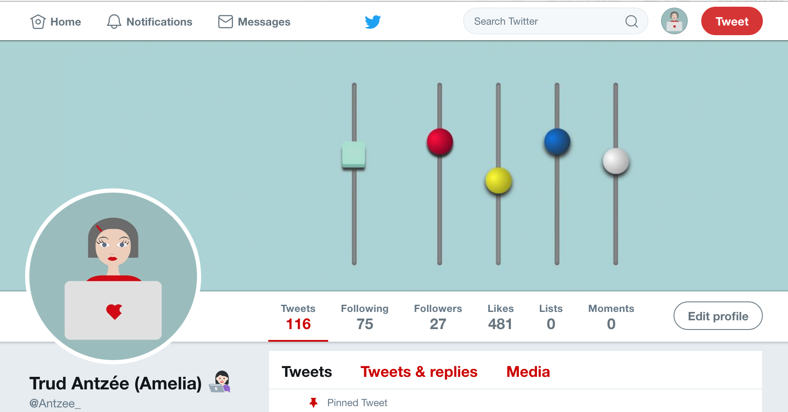

Today, I re-coded my avatar for social medias + found out how to make the sliders look spherical. And the sliders are movable now! I found a couple possible JavaScript solutions online, and I managed to get one slider to move, but needed help from my house teacher (the bf) for the rest: make all sliders move individually + an if else sentence to make the sliders stop at the beginning and end of the slots. Progress is slow, but I have a feeling that JavaScript can be fun once I master it a little bit better.
❇️ 🔴 🌕 🔵 ⚪️
  

### Day 21 - Sunday 21.01.2018 - Random inspiration day
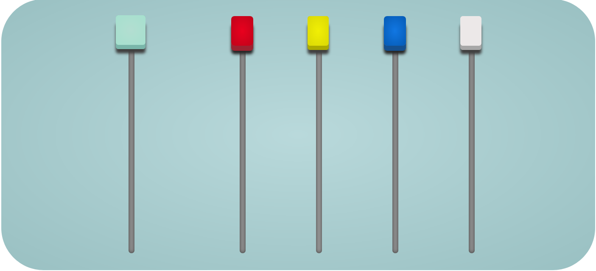

The other day, I saw that one guy had published his log on GitHub Pages. I decided to do the same, messed up my repository quite a bit, got help from my house teacher (the bf) to fix it, and now the log is published and it looks a lot better in that format. üòç [Take a look here](https://antzee1.github.io/100-days-of-code/) if you're reading this in the ReadMe file.

Next, I got inspired by a pretty [Dribbble shot of moving volume sliders](https://dribbble.com/shots/3106033-Volume-Sliders) by Daryl Bruinsma. I'm curious about user interactivity, so I wanted to see if it was possible to click and drag similar sliders, so I went online and found the JavaScript code for a draggable div. Spent the rest of the day doing the styling - struggled a bit with placement due to the JavaScript, but finally now everything stays in place, and the green slider is clickable. Next up is to adapt the JavaScript.

The colours are the same as the colours on my dad's beautiful old Hermes 3000 typewriter from the early 1960s. ❤️
  

### Day 20 - Saturday 20.01.2018 - CSS Grid with only images: a look at animation

Did a bit of light weekend coding. I had seen [a pen by Mandy Michael on CodePen](https://codepen.io/mandymichael/full/BWyYYP/) where it was possible to change the text directly on the interface, so I wanted to investigate that. Here's the result - you can try it out [here on CodePen](http://bit.ly/2DltdxQ). It works on iPad and iPhone as well as on computers, and it resizes nicely to all viewports, so I think I finally have got a better understanding of that!

Mandy Michael's pen is obviously a whole lot more exceptional since she also coded the letters! üòç

üí° Today's inspiration: The Instagram account of graphic designer and illustrator [Maria Diamantes](https://www.instagram.com/mariadiamantes/). üòç
  

### Day 19 - Friday 19.01.2018 - CSS Grid with only images: a look at animation

Was inspired by [this animation by Mantas Gr on Dribble](https://dribbble.com/shots/3531807-Reel-2017) today, so I wanted to see if I could animate movements of CSS Grid elements the same way - meaning that the item moves from one grid to another. Unfortunately, it looks like it's not possible, if I don't misunderstand the information I found online. I can make the div change placement on the grid, but it just changes abruptly, so there was no real movement animation effect like I was looking for üò≠

Felt a bit like I wasted a day, but I did write code, I practiced CSS Grid, and I guess that finding out what one cannot do is also part of learning! 🤔

❗️Update 20. January: I found a solution right after writing this yesterday - the transform: translate property. It doesn't *really* change the position of the div, but for all practical purposes, it looks like it does the job. 😍

The photos are from my Instagram account and are all related to Argentine social tango. Nope it's not like on television. 🤣
  

### Day 18 - Thursday 18.01.2018 - CSS Grid with only images: squares
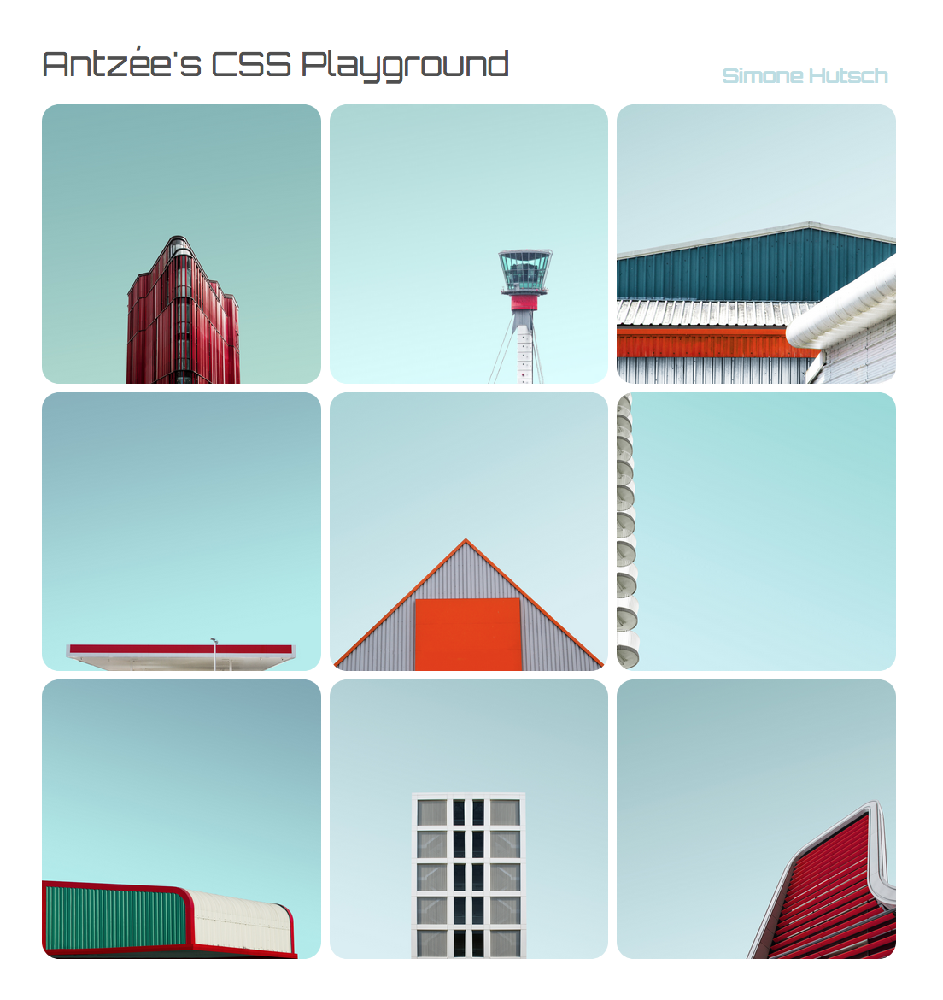

Made another CSS Grid layout. I struggled a bit, so it's clear that I need to study more and practice a lot! 😐 But in the end it worked as intended. 💪🏻 I also put an increase size on hover property on the images. I think that might work better with a responsive layout, though, so will experiment some more.

➡️ Today's resource: The photos I used are by [Simone Hutsch](https://unsplash.com/@heysupersimi) on [Unsplash](https://unsplash.com), a site with high quality, royalty free photos that can be used for whatever we want. It's really wonderful to have access to so many great pics without worrying about copyright. It's still nice to give credit, though. ❤️

Update: I made another version with auto-fit after I had written the log yesterday.
  

### Day 17 - Wednesday 17.01.2018 - CSS Grid with text and images: blog layout

My plan for today was to introduce images in addition to text in a CSS Grid and see if everything behaved. And it did! I started out with the layout I coded yesterday and added screenshots of some of my CSS art (although I'm not sure I dare calling it art), and then I got inspired to change the colours + make a header background-image in Photoshop as well. As I learn more about CSS Grid, I might discover better ways of doing this, but at least for now, it works in four browsers.

This is kinda an old-fashioned blog layout. Next step is to make media queries for smaller screens, and then I'll have to think up other layouts. That's a bit hard for me since I've been blogging for the last ten years, so I'm too used to this type of layout üôÑ
  

### Day 16 - Tuesday 16.01.2018 - CSS Grid with text
After yesterday's temporary lapse into fox territory, I felt ready to tackle the CSS Grid resource mountain again today. My plan was to change my retro-coloured Grid test layout into a simple website structure, and see how it would behave with text. After a bit of testing, I decided it worked best with set heights/widths on some divs, and auto on others. Am happy I already was a little bit familiar with Flexbox.

3 responsive columns:

 

2 fixed-size + 1 responsive column:

 

I guess it's easy to forget that one can't really practice layout without an idea about content. So I'll try to think up useful exercises for myself. Next: images and text together; then responsiveness for smaller screens.  
➡️ Today's resource: The Grid inspector in Firefox Developer Edition is super handy for understanding the structure of the layouts one is working on.
  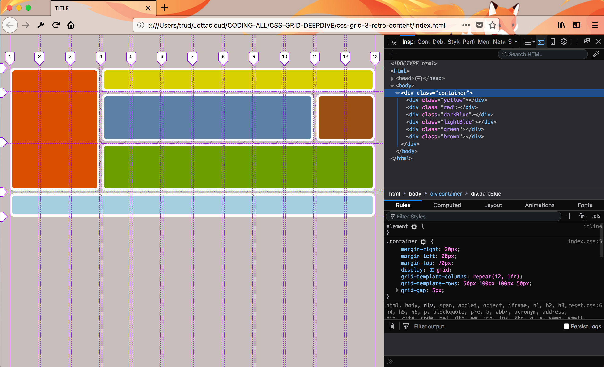
  

### Day 15 - Monday 15.01.2018 - Foxes! 🦊
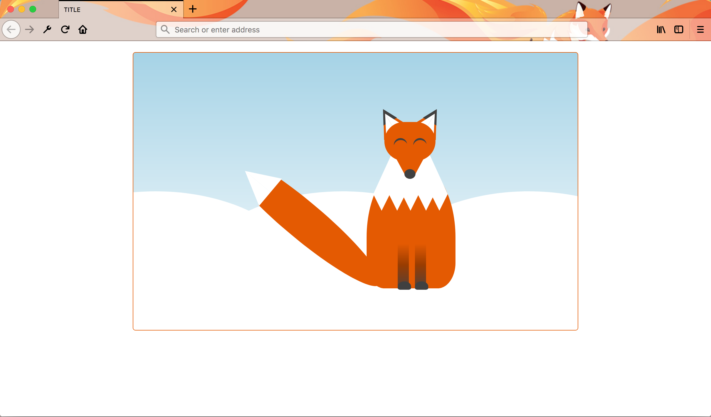

Today's plan: CSS Grid deep dive. What actually happened: foxes. The day went something like this: I looked at the page I made yesterday in the grid inspector in Firefox Developer Edition, which looks like a super handy tool. Then I read a CSS Grid article and got overwhelmed, so I customised my Firefox with a fox theme called ‘Mozilla: Firefox OS’ and coded a fox. He is my own design and he lives [here on CodePen](http://bit.ly/2mzrKwP). 🦊

üìï Today's resource: [This article](http://jensimmons.com/post/feb-27-2017/learn-css-grid) by Jen Simmons. It's chock full of links to CSS Grid learning resources.
  

### Day 14 - Sunday 14.01.2018 - Tango music learning game - flip cards inside CSS Grid

Today, my goal was to find a way of flipping a div with mouseclick (not just hover like yesterday's example), then make more divs and see if I could make  the flip cards work with CSS Grid. Needed lots of help from my house teacher (the bf). Progress has been made, though, and I hope I'll learn from using these concepts more.
  

### Day 13 - Saturday 13.01.2018 - Planning ahead: tango music learning games

I've been deeply in love with Argentine tango for the last 13 years. It's not the tango you see on TV (which is mostly show tango or ballroom tango), but Argentine tango as it's danced socially in Buenos Aires and all over the world. Since I'm a musician, I'm more than average interested in the Argentine tango music. I don't play tango, but I DJ regularly at Argentine social tango events in Oslo and also sometimes abroad.

Many dancers are interested in learning more about the music, so my bf, who also is a tango dancer, suggested that I study JavaScript by making some games about Argentine tango music. I think it's a nice idea, so today I found a tutorial on how to make a flip card using CSS and JS, and customised the code to learn how it works. Next step is to think of a concept.

➡️ Today's resource: [This article](https://davidwalsh.name/css-flip) from David Walsh.
  

### Day 12 - Friday 12.01.2018 - Crazy interactive CSS Grid + JavaScript project done

I finished the crazy CSS Grid + JavaScript project and put it online. I ended up using about 60 fractions in the grid in order to get the ratios on each square as true as possible to the original: the work “Composition A”, painted by Piet Mondrian in 1923. The idea is to start with just one visible square and the rest of the squares hidden, and have everything chained so when you click one square, the next one appears.

➡️ [View on CodePen](https://codepen.io/Antzee/full/dJKbrK/)

I made one JavaScript solution that worked; and when I asked the bf about other ways of doing it he suggested two alternatives. I used the first one since I didn’t understand the second one (but that one is definitely something I’ll work on since it was a nice solution with very little code).

There were a couple hiccups (if someone reads this and has an explanation, let me know via [Twitter](https://twitter.com/Antzee_) or CodePen):

- It doesn’t work in Safari on my MacBook unless I first click the first square, then switch to another desktop and back again.

- The reload page code I put on the last square doesn’t work in CodePen, only when I have the files locally on my computer.

In spite of this, I'm pretty happy with the result, mainly because I learnt both some CSS Grid and some JavaScript from making it! Already started thinking about making more (and better) interactive projects. 👩🏻‍💻
  

### Day 11 - Thursday 11.01.2018 - Crazy interactive CSS Grid + JavaScript project sneak peek
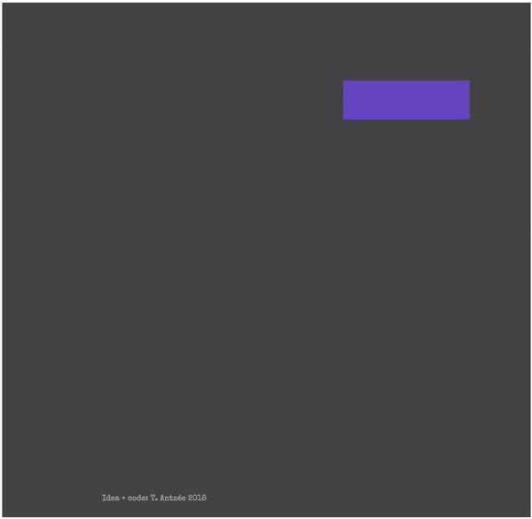

The small project I mentioned yesterday turned out to be a big project. Go figure. üòú It's almost done, though, so will post it tomorrow - I'll put it on CodePen since it's interactive.
  
Today's resource: the bf. üòç After I had written yesterday's log, I discussed with him whether there would be ways of writing less JavaScript code for this project. He suggested two different ways, and we looked at it together. In addition to reading, writing and watching tutorials, I find that it's really helpful to discuss code concepts with a real person, so I recommend to do that if you can find someone (preferably someone positive and helpful, of course)!
  

### Day 10 - Wednesday 10.01.2018 - Hidden divs: CSS Grid and JavaScript

Today, I combined my newly acquired CSS Grid and JavaScript function knowledge to make this. The idea was to see if it was possible to have a div hidden by default and then make it visible again. I’m planning a small fun project with this, looking forward to doing that tomorrow.
  
⬛️◽️🔲◼️▫️⬜️◾️◻️▪️🔳 
▫️⬜️◾️◻️▪️🔳⬛️◽️🔲◼️ 
🔲◼️▫️⬜️◾️◻️⬛️▪️🔳◽️ 
▫️⬜️◾️◻️▪️🔳⬛️◽️🔲◼️ 
⬛️◽️🔲◼️▫️⬜️◾️◻️▪️🔳
  
Progress: I still have to look up how to do things with JavaScript, but I hope that 1) seeing other people’s examples and 2) adapting those examples so they work with my code eventually will strengthen my understanding of the different JavaScript concepts.
  
➡️ Resources: I used the JS code from [W3schools: making a hidden by default div visible with JavaScript](https://www.w3schools.com/css/tryit.asp?filename=trycss_display_js).
  

### Day 9 - Tueday 09.01.2018 - CSS Grid basics

Today: more CSS Grid. I understand the basic principles and syntax now: columns, rows, and column lines. The GIF shows the responsive 12-column example I made with my retro-inspired design from day 6. I also familiarised myself with template areas. I’m just starting out, but so far, I really, really like CSS Grid. 😍 The code is beautiful - minimalistic and simple - and there are so many possibilities because one can structure content on both the horizontal and vertical axis. Am excited to see how it behaves with content inside! I also think one can do some fun creative stuff with it as well… 🤓

Today’s resources:
➡️ [Scrimba Learn CSS Grid for free](https://scrimba.com/g/gR8PTE) Video 4 and 5
➡️ Corresponding [Grid by Example](https://www.youtube.com/playlist?list=PLQkVA6z3dFvbnBJetfYDAF3-cG_ubgdZR) videos by Rachel Andrews.
  

### Day 8 - Monday 08.01.2018 - CSS image with JS to hide a div

Made this to put on my Facebook since I plan to be logged off a lot more than usual. I didn’t manage to do it exactly the way I wanted, which was a proper keyframes-animated toggle switch combined with JS to change the background. Now it's basically two images on top of each other below the actual button (which is transparent), and when someone clicks the button, the Facebook image gets hidden. So it’s a bit hacky, but the result looks more or less as I intended + I learnt to hide a div with JS.
  
The two images behind the switch are me-made in Photoshop Elements. PE was the quickest solution today since I haven’t worked much with Inkscape and SVGs yet. The sky image is clouds on a transparent background, which means I can control the background colour in CSS. It didn’t work as expected with gradients though, but I found a solution + explanation [here](https://stackoverflow.com/questions/5681813/transparent-background-image-with-a-gradient). The code:

background-image: url(‘../LINK’),
   linear-gradient(to bottom, rgb(120, 209, 221), rgb(213, 234, 236));

How to use JavaScript to hide a div:
➡️ [w3schools tutorial](https://www.w3schools.com/howto/howto_js_toggle_hide_show.asp)
➡️ [jsfiddle example](http://jsfiddle.net/BQUyT/2/)
  

### Day 7 - Sunday 07.01.2018 - Reading day
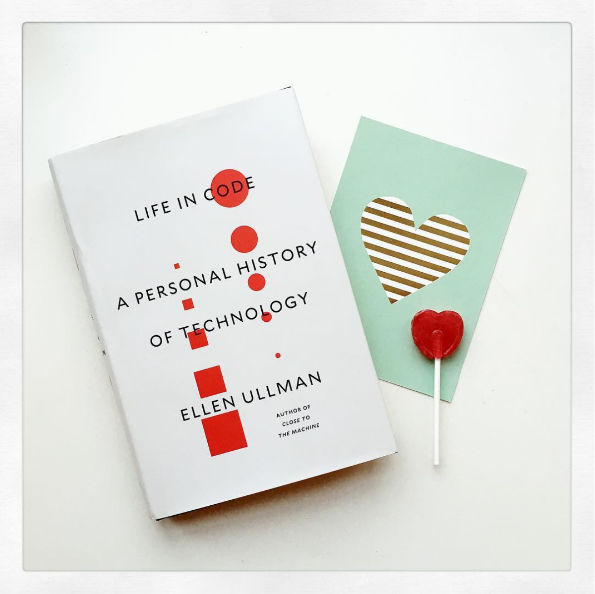

First week of the 100 Days Of Code challenge done! ✅ I'm not doing the challenge just to code every day; I'm doing it because I want to learn new stuff, which is always demanding. I'm making it even more demanding because I'm challenging myself in _how_ I study: trying to break the subjects down to manageable pieces, using different sources / methods to study each piece, and not moving on until I really have understood it. ✍🏻
  
So today I'm taking a day off from the screen to read this book I got from a friend: "Life In Code - a personal history of technology" by Ellen Ullman. It gives an interesting perspective because she's a woman and because she's been in the field since 1978. Back then, I was a kid in the Norwegian countryside and hadn't even heard of computers... üñ•
  Photo from [my Instagram](https://www.instagram.com/ameliacodes/) 📔❤️
  

### Day 6 - Saturday 06.01.2018 - CSS Grid basics: getting familiar with the syntax

Continued with CSS Grid, combining video, reading, and writing. I like to write my own examples so I’m sure I really understand everything in the code, so I made these retro-inspired babies who I’m gonna continue experimenting with to understand placement on the grid. I’ll share some code examples at a later stage. Am feeling a bit more comfortable with the syntax today than I felt yesterday 💪🏻
  
Today’s resources: 
➡️ [Firefox Devtool’s playground for CSS Grid](https://mozilladevelopers.github.io/playground/css-grid) 
➡️ [Scrimba’s “Learn CSS Grid for free”](https://scrimba.com/g/gR8PTE) - video 4
  

### Day 5 - Friday 05.01.2018 - Continuing CSS Grid; JS function practice
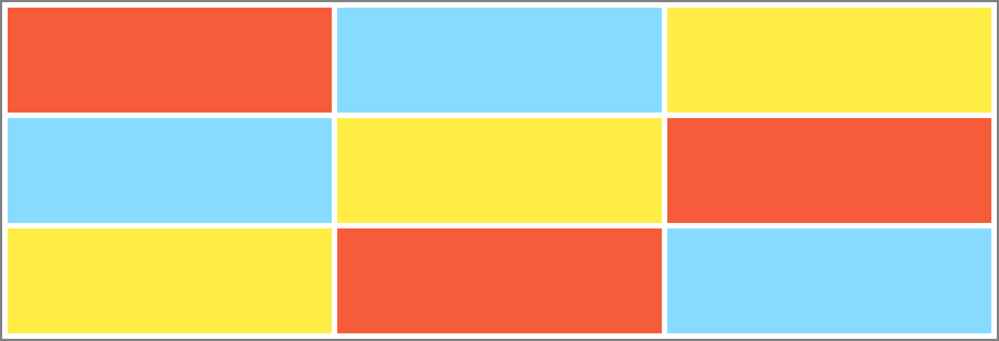

Today: CSS Grid + a little JavaScript. I went over the first Scrimba course videos again + looked up [Rachel Andrew’s CSS Grid videos on YouTube](https://www.youtube.com/watch?v=Dz9BzY21Zks&list=PLQkVA6z3dFvbnBJetfYDAF3-cG_ubgdZR). I think it’s good to switch between different types of resources, so I started reading [Mozilla’s CSS Grid Layout articles](https://developer.mozilla.org/en-US/docs/Web/CSS/CSS_Grid_Layout) on the topic as well. Played with the  first basics, like the fr unit, and made my first grid layout (screen shot above).
  
I also wrote a couple of JavaScript function examples to practice what I learned yesterday.
  
üòç Today's clever eye candy: [this pen by Josh Collinsworth‚Äè on CodePen](https://codepen.io/joshuajcollinsworth/full/aEJGvg/) üòç
(Don't forget to scroll)
  

### Day 4 - Thursday 04.01.2018 - JavaScript back to basics: functions

Started on JavaScript functions. Looked through a couple different videos, wrote my own versions of the examples, and talked some of it through with the bf. üíë
  
Since only reading and watching videos isn't enough, I’m trying to find a good way to practice writing own code (both for learning and for collecting examples). I like to use my regular editor, so for each topic, I make an HTML file with a JavaScript file linked to it to write examples. I test the code in a browser web console (also new to me, so I get to learn how that works). I think it might be useful to write a lot of own examples, so will start doing that.
  
Today’s resources: the same as yesterday.
   üìï By the way, ["Hello Ruby"](http://www.helloruby.com/) is a lovely children's book about programming. It includes lots of activities which should be nice to do together with grownups and/or friends. The book is written and illustrated by Linda Liukas.
  

### Day 3 - Wednesday 03.01.2018 - JavaScript back to basics: variables and arrays

[This talk](http://bit.ly/1byDzwo) by Kathy Sierra made me realise that I need to change how I study JavaScript (which I until now have found really difficult). So I’ve decided to try another way of structuring my learning process. Instead of just following one learning source, I'll:
♦️ combine different learning sources (videos and text)
♦️ write my own versions of examples
♦️ not move on until I feel comfortable with each topic.

Today, I went back to the beginning and revised variables & arrays. It's not the hardest part of JavaScript, but a good way of setting up and practicing a different workflow.

Today’s learning resources: 
➡️ [“Practical Javascript” by Gordon Zhu on Watch and Code](https://watchandcode.com/p/practical-javascript) 
➡️ [“The complete JavaScript course” by Jonas Schmedtmann on Udemy](https://www.udemy.com/the-complete-javascript-course/) 
➡️ [W3schools](https://www.w3schools.com/js/default.asp) for additional examples.
  

### Day 2 - Tuesday 02.01.2018 - CSS Grid - first look
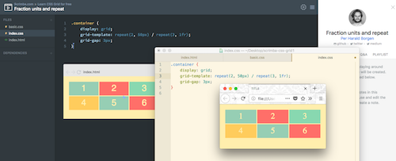
  Did the three first lessons of [Scrimba's "Learn CSS Grid for free" online course](https://scrimba.com/g/gR8PTE). It seems really good since it's an interactive video so I could play with edits both on the interface and in my own editor.
  

### Day 1 - Monday 01.01.2018 - the beginning
Simple start: commit to the 100 Days Of Code challenge and set it up on GitHub. Also (although it's not really coding) learn how to use markup language to format and add images in my log.
    
